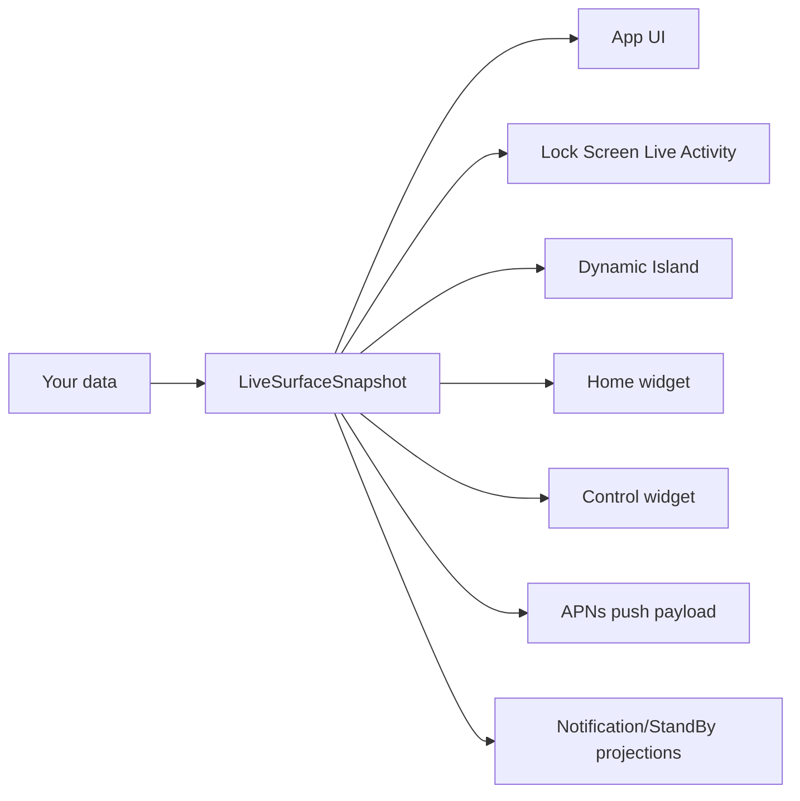

# Mobile Surfaces

Ship iOS Live Activities and Dynamic Island in a day, without becoming an iOS expert.

[](https://github.com/glendonC/mobile-surfaces/actions/workflows/ci.yml)
[](./LICENSE)

Two ways to use this repo:

1. **Run the starter** with `npm create mobile-surfaces@latest` and you get a working harness app with every surface wired up.
2. **Or skip the starter and import the standalone packages** — `@mobile-surfaces/surface-contracts` (the wire format) and `@mobile-surfaces/push` (the Node APNs SDK) work with any iOS Live Activity bridge, including [`expo-live-activity`](https://github.com/software-mansion-labs/expo-live-activity) or a hand-rolled native module.

## What is this?

A one-command install that gives you a working iOS app with multiple surfaces wired together:

- The **app UI** (a React Native screen, you customize this).
- The **Lock Screen Live Activity** — the persistent panel that shows real-time updates while the phone is locked.
- The **Dynamic Island** — the pill at the top of newer iPhones.
- A **home-screen widget** backed by shared App Group state.
- An **iOS 18 control widget** for Control Center / Lock Screen controls.

All of them render from one shared data shape, so they stay in sync automatically. You write one function that produces that shape from your own data; everything else is already done.

The contract package and the push SDK are bridge-agnostic — they don't import the rest of the starter and they don't care which ActivityKit bridge you use. See ["Use it without the starter"](#use-it-without-the-starter) below.

## Why this exists

iOS Live Activities fail silently.

Your code compiles. Your push returns HTTP 200. The app runs. And nothing shows up on the Lock Screen. There's no error, no log, no signal explaining why. Apple's docs cover roughly half of what you actually need; the other half lives in scattered GitHub issues and dev forum threads.

Most people who try to add Live Activities to an Expo app spend days fighting silent failures: token environment mismatches, byte-identical Swift files, push priority budgets, embedded extensions that didn't link, deployment targets off by a minor version, generated `ios/` files getting wiped on the next build.

Mobile Surfaces is the working baseline past every one of those traps. You start where most people give up.

## Try it

```bash
npm create mobile-surfaces@latest
```

The CLI checks your toolchain (macOS, Xcode, Node, an iOS simulator), prompts for your app's name and bundle id, installs everything, and prepares your iOS build. Then run `pnpm mobile:sim` to launch the demo on your simulator.

That's it. No Xcode UI to navigate, no Swift you have to write up front, no APNs setup before you can see something work.

## How it works

You write one function:

```ts
function snapshotFromJob(job: Job): LiveSurfaceSnapshot {
  return {
    schemaVersion: "1",
    kind: "liveActivity",            // discriminator — picks the projection
    id: `${job.id}@${job.revision}`,
    surfaceId: `job-${job.id}`,
    state: job.status,               // "queued" | "active" | "completed" | …
    modeLabel: "active",
    contextLabel: job.queueName,
    statusLine: `${job.queueName} · ${Math.round(job.progress * 100)}%`,
    primaryText: job.title,          // headline shown on the Lock Screen
    secondaryText: job.subtitle,     // subhead
    estimatedSeconds: job.etaSeconds ?? 0,
    morePartsCount: 0,
    progress: job.progress,          // 0 to 1
    stage: job.status === "done" ? "completing" : "inProgress",
    deepLink: `myapp://surface/job-${job.id}`,
  };
}
```

That `LiveSurfaceSnapshot` shape feeds every surface:



Change the snapshot once, every surface updates together. They can't drift, because they're all reading from the same shape. The shape is defined in TypeScript with a runtime validator (Zod-backed `z.discriminatedUnion("kind", […])`), so your editor and your CI both catch mistakes before they ship.

## Use it without the starter

If you already have an Expo app with `expo-live-activity` (or a hand-rolled bridge), you don't need the harness. The contract and push packages stand alone.

### Just the contract

For type-safe wire payloads, validation at the backend boundary, JSON Schema, and `kind`-gated projection helpers:

```bash
pnpm add @mobile-surfaces/surface-contracts
```

```ts
import {
  assertSnapshot,
  toLiveActivityContentState,
} from "@mobile-surfaces/surface-contracts";

const snapshot = assertSnapshot(snapshotFromJob(job));
const contentState = toLiveActivityContentState(snapshot);
// → { headline, subhead, progress, stage } — pass to your existing bridge.
```

See [packages/surface-contracts/README.md](./packages/surface-contracts/README.md) for the bridge-agnostic walkthrough (`expo-live-activity`, hand-rolled, Standard Schema interop, JSON Schema, v0 → v1 migration).

### Contract + push SDK

For the full backend story — APNs JWT signing, HTTP/2 session pooling, push-to-start, channel push, retry policy, typed error classes:

```bash
pnpm add @mobile-surfaces/surface-contracts @mobile-surfaces/push
```

```ts
import { createPushClient } from "@mobile-surfaces/push";
import { assertSnapshot } from "@mobile-surfaces/surface-contracts";

const client = createPushClient({
  keyId: process.env.APNS_KEY_ID!,
  teamId: process.env.APNS_TEAM_ID!,
  keyPath: process.env.APNS_KEY_PATH!,
  bundleId: process.env.APNS_BUNDLE_ID!,
  environment: "development",
});

const snapshot = assertSnapshot(snapshotFromJob(job));
await client.update(activityToken, snapshot);
```

`@mobile-surfaces/push` has zero npm runtime dependencies — `node:http2`, `node:crypto`, and the workspace contract package only. See [packages/push/README.md](./packages/push/README.md) and [docs/push.md](./docs/push.md) for the deep reference (token taxonomy, error classes, channel management, retry policy).

## What's actually in the box

- A working Expo app with every surface already wired up: Lock Screen Live Activity, Dynamic Island, home-screen widget, iOS 18 control widget.
- The shared `LiveSurfaceSnapshot` contract — one TypeScript type, one Zod-backed `z.discriminatedUnion("kind", […])`, one published JSON Schema (`oneOf`-shaped per the discriminator), kind-gated projection helpers, and `safeParseAnyVersion` for v0 → v1 migration. Standard Schema is exposed via Zod 4's built-in `~standard` getter so consumers can drop the Zod runtime dep.
- `@mobile-surfaces/push` — Node SDK for APNs with zero npm runtime deps, supporting alerts, Live Activity start/update/end, **push-to-start (iOS 17.2+)** and **broadcast channels (iOS 18+)**, plus channel management.
- A SwiftUI WidgetKit extension for Lock Screen, Dynamic Island, home-screen widget, and iOS 18 control layouts. You can restyle it; you don't have to write it from scratch.
- APNs scripts with JWT signing, dev/prod environment routing, and translated error messages.
- A `doctor` command that catches setup mistakes before you waste a day on them.
- Pinned, tested-together versions of Expo, React Native, Xcode, and the widget tooling.

The Live Activity bridge currently lives in `packages/live-activity` and exposes `pushTokenUpdates`, `activityStateUpdates`, `pushToStartTokenUpdates` (iOS 17.2+), and an optional `channelId` for `Activity.request(pushType: .channel(...))` on iOS 18+. SPM-shared Swift consolidation (Phase 5 of the in-flight refactor) is **deferred upstream-blocked** — `@bacons/apple-targets` 4.0.6 + RN 0.83.6 lack local SPM support; revisit on Expo SDK 56. Byte-identical Swift duplication remains in the meantime, enforced by `scripts/check-activity-attributes.mjs`.

## Adding to an existing Expo app

If you already have an Expo app, `npm create mobile-surfaces` detects it and switches to add-to-existing mode: it patches your `app.json`, copies in the widget target, adds the right Info.plist keys, and shows you a recap of every change before applying it. No surprise edits.

If your project isn't an Expo app yet (web-only, native iOS, something else), the CLI scaffolds a fresh `apps/mobile/` you can wire your backend into.

## Requirements

The CLI checks all of this for you, but for reference:

| Expo SDK | React Native | React | iOS minimum | Xcode | `@bacons/apple-targets` |
| --- | --- | --- | --- | --- | --- |
| 55 | 0.83.6 | 19.2.0 | 17.2 | 26 | 4.0.6 |

- An Apple Developer account, but only when you're ready to test on a real device.
- Node 24.

The iOS-17.2 floor is deliberate so push-to-start tokens (`Activity<…>.pushToStartTokenUpdates`) are available without `if #available` ceremony. Dynamic Island additionally requires iPhone 14 Pro or newer. See [docs/compatibility.md](./docs/compatibility.md) for the full toolchain row and upgrade ritual.

## What this is not

- Not for Android. iOS only.
- Not a production push service — it ships smoke-test scripts and a Node SDK, not infrastructure.
- Not a no-code tool. You're still writing TypeScript and SwiftUI; this just removes the iOS plumbing you didn't sign up to learn.

## Docs

- [Backend integration](./docs/backend-integration.md) — domain event → snapshot → APNs.
- [Push](./docs/push.md) — wire-layer reference: SDK, smoke script, token taxonomy, error reasons, channel push.
- [Multi-surface](./docs/multi-surface.md) — every `kind` value, what ships today, when to emit each.
- [Schema migration](./docs/schema-migration.md) — v0 → v1 codec, Standard Schema interop, evolution policy.
- [Architecture](./docs/architecture.md) — the contract, the surfaces, the adapter boundary.
- [Troubleshooting](./docs/troubleshooting.md) — the silent-failure cookbook.
- [iOS environment](./docs/ios-environment.md) — simulator vs device, APNs setup.
- [Compatibility](./docs/compatibility.md) — pinned toolchain row.
- [Roadmap](./docs/roadmap.md) — what's next, what's intentionally out of scope.

## Contributing

See [CONTRIBUTING.md](./CONTRIBUTING.md). Issues and PRs welcome.

## License

MIT
