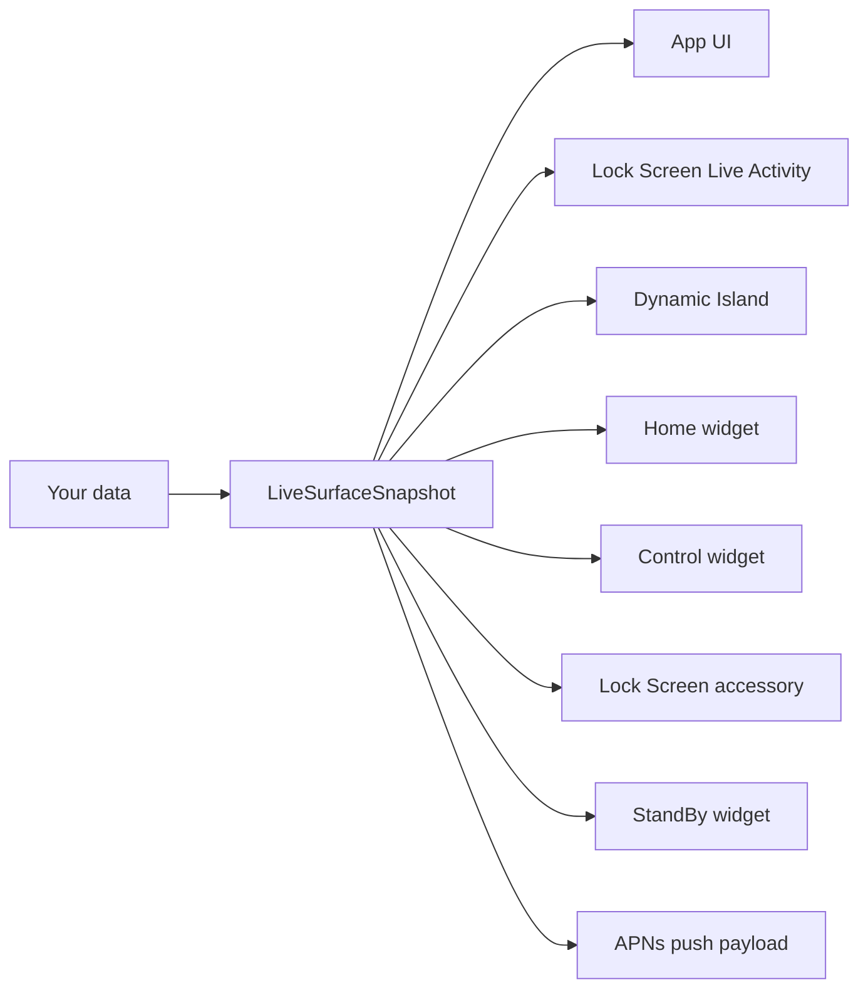

# Mobile Surfaces

A working baseline for iOS Live Activities, Dynamic Island, home-screen widgets, and iOS 18 control widgets. One snapshot shape drives every surface. Iterate against the simulator in an afternoon; a device-tested push round-trip is a weekend once you have an Apple Developer account and an APNs auth key.

[](https://github.com/glendonC/mobile-surfaces/actions/workflows/ci.yml)
[](./LICENSE)

## Pick your path

### I want a working Expo starter

```bash
npm create mobile-surfaces@latest
```

You get a working iPhone app with every surface wired up, the trap checks installed in CI, and a push SDK ready for an APNs auth key. Then run `pnpm mobile:sim` to launch the demo on your simulator. No Xcode UI to navigate, no Swift to write up front, no APNs setup before you see something on screen.

### I already have a bridge, or I am building a backend

```bash
pnpm add @mobile-surfaces/surface-contracts @mobile-surfaces/push
```

Both packages are bridge-agnostic. The contract package is one TypeScript type (`LiveSurfaceSnapshot`) that feeds every iOS surface through `kind`-gated projection helpers; the push SDK is the Node APNs client that drives it. They work with [`expo-live-activity`](https://github.com/software-mansion-labs/expo-live-activity), a hand-rolled native module, or this repo's bridge. They do not import the starter and they do not care which ActivityKit bridge you use.

The contract package has its own walkthrough in [packages/surface-contracts/README.md](./packages/surface-contracts/README.md). The push SDK reference is in [packages/push/README.md](./packages/push/README.md) and the wire-layer deep dive at [mobile-surfaces.com/docs/push](https://mobile-surfaces.com/docs/push).

## What is shipped

| Surface | Status | Native target |
| --- | --- | --- |
| Lock Screen Live Activity | Shipped | `MobileSurfacesLiveActivity.swift` |
| Dynamic Island | Shipped | Same (ActivityKit renders both from one `Activity`) |
| Home-screen widget | Shipped | `MobileSurfacesHomeWidget.swift` |
| iOS 18 control widget | Shipped | `MobileSurfacesControlWidget.swift` + shared App Intents |
| Lock Screen accessory | Shipped | `MobileSurfacesLockAccessoryWidget.swift` |
| StandBy widget | Shipped | `MobileSurfacesStandbyWidget.swift` |
| Push notification (basic alert) | Shipped | `client.sendNotification(...)` projects through `toNotificationContentPayload` |
| Notification content extension (rich layouts, images) | Pending | Contract slice ships; the `UNNotificationContentExtension` target is not in the scaffold yet |

Every shipped surface renders from the same `LiveSurfaceSnapshot`. They cannot drift, because they all project from one source. See [Multi-surface](https://mobile-surfaces.com/docs/multi-surface) for every `kind` value, its projection helper, and when to emit it.

## Why this exists

Live Activities are the small live-updating panels iPhones show on the Lock Screen and in the Dynamic Island during real-time tasks. The Uber driver approaching, the sports game in progress, the food order being prepared. They look simple from the outside. Building one is not.

The hard part is not the code. The hard part is that everything fails silently.

Your code compiles. Your push to Apple returns HTTP 200. The app runs. And nothing shows up on the Lock Screen. There is no error message and no log to tell you what went wrong. The cause is one of a dozen iOS-specific traps that Apple's documentation barely mentions:

- Push tokens minted by your dev build cannot talk to Apple's production server, but the failure looks like a generic 400.
- Two Swift files in different folders have to be byte-identical or your activity silently never appears.
- Your app and your widget share state through a hidden identifier called an App Group. If the two sides do not match exactly, the widget reads placeholder data forever.
- Apple aggressively rate-limits high-priority Live Activity pushes; sustained sends get silently dropped.
- The generated `ios/` directory rebuilds from scratch on every prebuild, so any manual fix you make in Xcode gets wiped.

Add a home-screen widget, an iOS 18 Control Center button, and a backend that drives all of it through Apple's push notification service, and the surface area for silent failure roughly doubles.

Mobile Surfaces catalogs these traps as [`data/traps.json`](./data/traps.json) (33 invariants, rendered as [`AGENTS.md`](./AGENTS.md) and [`CLAUDE.md`](./CLAUDE.md)) and enforces them in CI through `pnpm surface:check`. Static rules are caught at PR time; runtime rules surface as typed errors from the push SDK. You start where most people give up.

## Working with AI coding assistants

Mobile Surfaces is designed to give AI assistants something concrete to ground against. The contract is a discriminated union with semantic field descriptions that flow into the published JSON Schema, so an LLM emitting a snapshot has a typed surface to project into rather than free-form JSON. The trap catalog is a stable list of mandatory rules the assistant must respect, with stable ids and pinned enforcement scripts.

Point your assistant at [`AGENTS.md`](./AGENTS.md) (used by Codex, Cursor, Aider, Windsurf, Factory, Zed, Warp, and Copilot) or [`CLAUDE.md`](./CLAUDE.md) (used by Claude Code). Both are generated from the same catalog; they cannot drift.

When the assistant breaks an invariant, the violation is loud: CI fails on a static check, the push SDK rejects an invalid snapshot at construction time, or a typed APNs error names the exact trap id. The cost of being wrong stays at PR review, not at "my Live Activity is invisible on a customer device."

## Why not use [`expo-live-activity`](https://github.com/software-mansion-labs/expo-live-activity)?

`expo-live-activity` is the popular Expo bridge for Live Activities, maintained by Software Mansion. If you only need a Lock Screen panel and you are happy hand-rolling the rest, it is a fine choice. It is narrower, simpler, and has more contributors and shipped apps behind it.

What it does not cover:

- **Home-screen widgets, iOS 18 control widgets, lock accessory, StandBy.** It only renders the Lock Screen Live Activity and the Dynamic Island. If you want the same data on other surfaces, you build that yourself.
- **The backend.** It hands your app a push token and stops there. You write the APNs HTTP/2 client, the JWT signing, the retry logic, and the error-code translator yourself. That is two to three weeks of work for someone who has not done it before.
- **A shared data contract.** Without one, each surface gets its own hand-rolled mapping function. They drift the moment one is updated and the others are not.

Where `expo-live-activity` is genuinely ahead: its bridge surface is wider. It exposes `relevanceScore`, custom small images, compact-trailing fallbacks, and other ActivityKit knobs the Mobile Surfaces bridge does not. It also has more shipped apps and contributors behind it; Mobile Surfaces' bridge is newer.

Pick `expo-live-activity` for a single-surface project where the backend is already solved, or where you need the wider ActivityKit knob surface. Pick Mobile Surfaces when you want multiple surfaces sharing one data shape and a Node SDK that drives the push side. The `@mobile-surfaces/surface-contracts` and `@mobile-surfaces/push` packages are bridge-agnostic and work alongside `expo-live-activity` if you want both.

## How it works

You write one function:

```ts
function snapshotFromJob(job: Job): LiveSurfaceSnapshot {
  return {
    schemaVersion: "4",
    kind: "liveActivity",            // discriminator that picks the projection
    id: `${job.id}@${job.revision}`,
    surfaceId: `job-${job.id}`,
    updatedAt: new Date().toISOString(),
    state: job.status,               // "queued" | "active" | "completed" ...
    liveActivity: {
      title: job.title,
      body: job.subtitle,
      progress: job.progress,        // 0 to 1
      deepLink: `myapp://surface/job-${job.id}`,
      modeLabel: "active",
      contextLabel: job.queueName,
      statusLine: `${job.queueName} · ${Math.round(job.progress * 100)}%`,
      stage: job.status === "done" ? "completing" : "inProgress",
      estimatedSeconds: job.etaSeconds ?? 0,
      morePartsCount: 0,
    },
  };
}
```

That `LiveSurfaceSnapshot` shape feeds every surface:



Change the snapshot once, every surface updates together. They cannot drift, because they are all reading from the same shape. The shape is defined in TypeScript with a runtime validator: `kind` picks which branch is valid, and Zod checks that the matching fields are present. Your editor and your CI both catch mistakes before they ship.

## Use it without the starter

If you already have an Expo app with `expo-live-activity` (or a hand-rolled bridge), you do not need the harness. The contract and push packages stand alone.

### Just the contract

For type-safe wire payloads, validation at the backend boundary, JSON Schema, and `kind`-gated projection helpers:

```bash
pnpm add @mobile-surfaces/surface-contracts
```

```ts
import {
  assertSnapshot,
  toLiveActivityContentState,
} from "@mobile-surfaces/surface-contracts";

const snapshot = assertSnapshot(snapshotFromJob(job));
const contentState = toLiveActivityContentState(snapshot);
// { headline, subhead, progress, stage }, pass to your existing bridge.
```

See [packages/surface-contracts/README.md](./packages/surface-contracts/README.md) for the bridge-agnostic walkthrough (`expo-live-activity`, hand-rolled, Standard Schema interop, JSON Schema, v3 to v4 migration).

### Contract plus push SDK

For the full backend story (APNs JWT signing, HTTP/2 session pooling, push-to-start, channel push, retry policy, typed error classes):

```bash
pnpm add @mobile-surfaces/surface-contracts @mobile-surfaces/push
```

```ts
import { createPushClient } from "@mobile-surfaces/push";
import { assertSnapshot } from "@mobile-surfaces/surface-contracts";

const client = createPushClient({
  keyId: process.env.APNS_KEY_ID!,
  teamId: process.env.APNS_TEAM_ID!,
  keyPath: process.env.APNS_KEY_PATH!,
  bundleId: process.env.APNS_BUNDLE_ID!,
  environment: "development",
});

const snapshot = assertSnapshot(snapshotFromJob(job));
await client.update(activityToken, snapshot);
```

`@mobile-surfaces/push` is wire-layer code only. It uses `node:http2`, `node:crypto`, and the workspace contract package directly, with `zod` as a peer dependency (the same instance the contract uses, so schemas stay interoperable). No third-party HTTP, APNs, or retry framework underneath. See [packages/push/README.md](./packages/push/README.md) and [mobile-surfaces.com/docs/push](https://mobile-surfaces.com/docs/push) for the deep reference (token taxonomy, error classes, channel management, retry policy).

## Scripted CLI usage

If you are wiring the starter into CI, an AI agent, or any non-interactive automation, pass `--yes` plus the required fields to skip every prompt:

```bash
npm create mobile-surfaces@latest --yes \
  --name my-app --bundle-id com.acme.myapp \
  --no-install
```

The CLI detects four starting situations:

- **Empty directory.** Scaffolds a fresh project in place.
- **An existing Expo app.** Switches to add-to-existing mode, recaps every change, then patches `app.json`, copies the widget target, and adds Info.plist keys.
- **A TypeScript monorepo without Expo.** Scaffolds `apps/mobile/` inside the workspace and adds the workspace globs needed for it.
- **Anything else with files in it.** Refuses with an exit code of `1`, so CI stops early.

The exit-code contract is `0` success, `1` user error (bad inputs), `2` environment error (missing tools, install failed), `3` template error (the published CLI is broken), `130` interrupted (Ctrl+C). See [packages/create-mobile-surfaces/README.md](./packages/create-mobile-surfaces/README.md) for the full flag reference and a CI workflow example.

## What is actually in the box

- A working Expo app with every shipped surface wired up: Lock Screen Live Activity, Dynamic Island, home-screen widget, iOS 18 control widget, lock accessory, StandBy.
- The shared `LiveSurfaceSnapshot` contract: one TypeScript type, one runtime-checked union where `kind` selects the valid branch, one published JSON Schema (`oneOf`-shaped per the discriminator), kind-gated projection helpers, and `safeParseAnyVersion` for schema v3 to v4 migration. Standard Schema is exposed via Zod 4's built-in `~standard` getter so consumers can drop the Zod runtime dependency.
- `@mobile-surfaces/push`. A Node SDK for APNs with no third-party HTTP or retry framework underneath, supporting alerts, Live Activity start/update/end, push-to-start (iOS 17.2+) and broadcast channels (iOS 18+), plus channel management. Priority-aware retry stretch (priority 10 sends clamp to 2 retries to stay inside Apple's MS015 budget) and an `MOBILE_SURFACES_PUSH_DISABLE_RETRY` kill switch.
- A SwiftUI WidgetKit extension for Lock Screen, Dynamic Island, home-screen widget, lock accessory, StandBy, and iOS 18 control layouts. You can restyle it. You do not have to write it from scratch.
- APNs scripts with JWT signing, development and production environment routing, and translated error messages.
- A `doctor` command that catches setup mistakes before you waste a day on them.
- Pinned, tested-together versions of Expo, React Native, Xcode, and the widget tooling.

The Live Activity bridge currently lives in `packages/live-activity` and exposes `pushTokenUpdates`, `activityStateUpdates`, `pushToStartTokenUpdates` (iOS 17.2+), and an optional `channelId` for `Activity.request(pushType: .channel(...))` on iOS 18+.

## Adding to an existing Expo app

If you already have an Expo app, `npm create mobile-surfaces` detects it and switches to add-to-existing mode. It patches your `app.json`, copies in the widget target, adds the right Info.plist keys, and shows you a recap of every change before applying it. No surprise edits.

If your project is not an Expo app yet (web-only, native iOS, something else), the CLI scaffolds a fresh `apps/mobile/` you can wire your backend into.

## Requirements

The CLI checks all of this for you. For reference:

| Expo SDK | React Native | React | iOS minimum | Xcode | `@bacons/apple-targets` |
| --- | --- | --- | --- | --- | --- |
| 55 | 0.83.6 | 19.2.0 | 17.2 | 26 | 4.0.6 |

You also need an Apple Developer account (but only when you are ready to test on a real device) and Node 24.

The iOS 17.2 floor is deliberate so push-to-start tokens (`Activity<…>.pushToStartTokenUpdates`) are available without conditional version checks. Dynamic Island additionally requires iPhone 14 Pro or newer. See [mobile-surfaces.com/docs/compatibility](https://mobile-surfaces.com/docs/compatibility) for the full toolchain row and upgrade ritual.

## What this is not

- Not for Android. iOS only.
- Not a production push service. It ships smoke-test scripts and a Node SDK, not infrastructure.
- Not a no-code tool. You are still writing TypeScript and SwiftUI. This just removes the iOS plumbing you did not sign up to learn.

## Docs

Start with the [docs hub](https://mobile-surfaces.com/docs) if you are not sure where to go next. It has reading paths for trying the starter, adding to an existing Expo app, writing a backend, debugging silent failures, and maintaining releases.

- [Building your app](https://mobile-surfaces.com/docs/building-your-app). Concrete migration from the harness to your domain screen, with a worked example.
- [Scenarios](https://mobile-surfaces.com/docs/scenarios). Canonical multi-step flows across all surfaces.
- [Backend integration](https://mobile-surfaces.com/docs/backend-integration). Domain event to snapshot to APNs.
- [Push](https://mobile-surfaces.com/docs/push). Wire-layer reference, SDK, smoke script, token taxonomy, error reasons, channel push.
- [Observability](https://mobile-surfaces.com/docs/observability). Which catalog-bound errors are worth alerting on, hook signatures, recommended log shape.
- [Multi-surface](https://mobile-surfaces.com/docs/multi-surface). Every `kind` value, what ships today, when to emit each.
- [Schema migration](https://mobile-surfaces.com/docs/schema-migration). v3 to v4 codec, deprecation timeline, Standard Schema interop, evolution policy.
- [Architecture](https://mobile-surfaces.com/docs/architecture). The contract, the surfaces, the adapter boundary.
- [Troubleshooting](https://mobile-surfaces.com/docs/troubleshooting). The silent-failure cookbook.
- [iOS environment](https://mobile-surfaces.com/docs/ios-environment). Simulator vs device, APNs setup.
- [Compatibility](https://mobile-surfaces.com/docs/compatibility). Pinned toolchain row.
- [Release](https://mobile-surfaces.com/docs/release). Changesets release PRs and npm trusted publishing.
- [Roadmap](https://mobile-surfaces.com/docs/roadmap). What is next, what is intentionally out of scope.

For AI coding assistants working in this repo, see [`AGENTS.md`](./AGENTS.md) (or [`CLAUDE.md`](./CLAUDE.md) for Claude Code).

## Contributing

See [CONTRIBUTING.md](./CONTRIBUTING.md). Issues and PRs welcome.

## License

MIT
