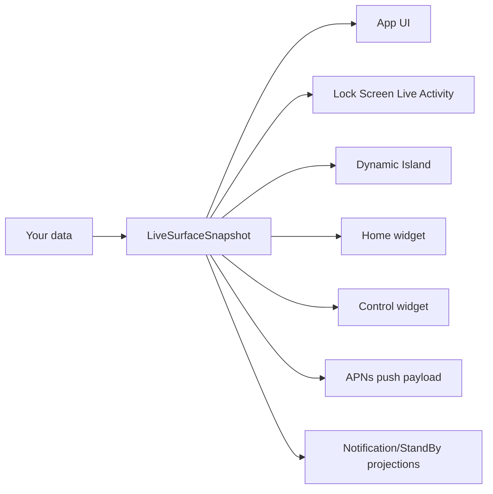

# Mobile Surfaces

Ship iOS Live Activities and Dynamic Island in a day, without becoming an iOS expert.

[](https://github.com/glendonC/mobile-surfaces/actions/workflows/ci.yml)
[](./LICENSE)

## What is this?

A one-command install that gives you a working iOS app with multiple surfaces wired together:

- The **app UI** (a React Native screen, you customize this).
- The **Lock Screen Live Activity** — the persistent panel that shows real-time updates while the phone is locked.
- The **Dynamic Island** — the pill at the top of newer iPhones.
- A **home-screen widget** backed by shared App Group state.
- An **iOS 18 control widget** for Control Center / Lock Screen controls.

All three render from one shared data shape, so they stay in sync automatically. You write one function that produces that shape from your own data; everything else is already done.

## Why this exists

iOS Live Activities fail silently.

Your code compiles. Your push returns HTTP 200. The app runs. And nothing shows up on the Lock Screen. There's no error, no log, no signal explaining why. Apple's docs cover roughly half of what you actually need; the other half lives in scattered GitHub issues and dev forum threads.

Most people who try to add Live Activities to an Expo app spend three to seven days fighting silent failures: token environment mismatches, byte-identical Swift files, push priority budgets, embedded extensions that didn't link, deployment targets off by a minor version, generated `ios/` files getting wiped on the next build.

Mobile Surfaces is the working baseline past every one of those traps. You start where most people give up.

## Try it

```bash
npm create mobile-surfaces@latest
```

The CLI checks your toolchain (macOS, Xcode, Node, an iOS simulator), prompts for your app's name and bundle id, installs everything, and prepares your iOS build. Then run `pnpm mobile:sim` to launch the demo on your simulator.

That's it. No Xcode UI to navigate, no Swift you have to write up front, no APNs setup before you can see something work.

## How it works

You write one function:

```ts
function snapshotFromJob(job: Job): LiveSurfaceSnapshot {
  return {
    schemaVersion: "1",
    kind: "liveActivity",
    id: `${job.id}@${job.revision}`,
    surfaceId: `job-${job.id}`,
    state: job.status,             // "queued" | "active" | "completed" | …
    primaryText: job.title,        // the headline shown on the Lock Screen
    secondaryText: job.subtitle,   // subhead
    progress: job.progress,        // 0 to 1
    deepLink: `myapp://surface/job-${job.id}`,
    // …a few more typed fields, all checked at compile time and runtime
  };
}
```

That `LiveSurfaceSnapshot` shape feeds every surface:



Change the snapshot once, every surface updates together. They can't drift, because they're all reading from the same shape. The shape is defined in TypeScript with a runtime validator, so your editor and your CI both catch mistakes before they ship.

## What's actually in the box

- A working Expo app with all three surfaces already wired up.
- The shared `LiveSurfaceSnapshot` contract (one TypeScript type, one Zod validator, one published JSON Schema, and kind-gated projections).
- A SwiftUI WidgetKit extension for Lock Screen, Dynamic Island, home-screen widget, and iOS 18 control layouts. You can restyle it; you don't have to write it from scratch.
- APNs scripts with JWT signing, dev/prod environment routing, and translated error messages.
- A `doctor` command that catches setup mistakes before you waste a day on them.
- Pinned, tested-together versions of Expo, React Native, Xcode, and the widget tooling.

## Adding to an existing Expo app

If you already have an Expo app, `npm create mobile-surfaces` detects it and switches to add-to-existing mode: it patches your `app.json`, copies in the widget target, adds the right Info.plist keys, and shows you a recap of every change before applying it. No surprise edits.

If your project isn't an Expo app yet (web-only, native iOS, something else), the CLI scaffolds a fresh `apps/mobile/` you can wire your backend into.

## Requirements

The CLI checks all of this for you, but for reference:

- macOS with Xcode 26 or newer.
- An iOS 17.2+ simulator. The CLI will list available ones.
- Node 24.
- An Apple Developer account, but only when you're ready to test on a real device.

## What this is not

- Not for Android. iOS only.
- Not a production push service — it ships smoke-test scripts, not infrastructure.
- Not a no-code tool. You're still writing TypeScript and SwiftUI; this just removes the iOS plumbing you didn't sign up to learn.

## Docs

- [Backend integration](./docs/backend-integration.md) — how your server sends pushes.
- [Architecture](./docs/architecture.md) — the contract, the surfaces, the adapter boundary.
- [Troubleshooting](./docs/troubleshooting.md) — the silent-failure cookbook.
- [iOS environment](./docs/ios-environment.md) — simulator vs device, APNs setup.
- [Compatibility](./docs/compatibility.md) — pinned toolchain row.
- [Roadmap](./docs/roadmap.md) — what's next, what's intentionally out of scope.

## Contributing

See [CONTRIBUTING.md](./CONTRIBUTING.md). Issues and PRs welcome.

## License

MIT
