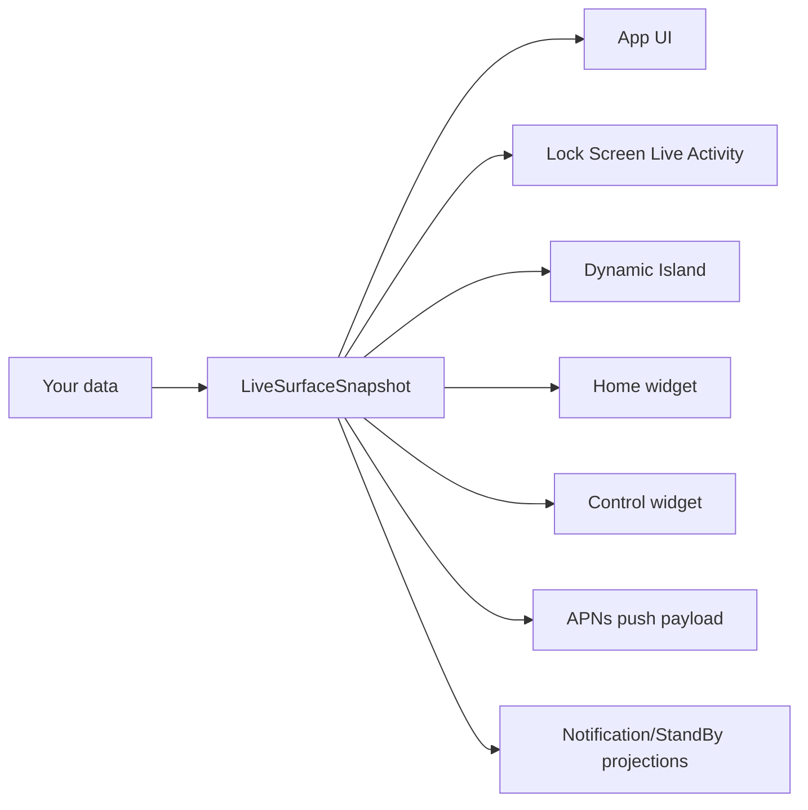

# Mobile Surfaces

Ship iOS Live Activities and Dynamic Island in a day, without becoming an iOS expert.

[](https://github.com/glendonC/mobile-surfaces/actions/workflows/ci.yml)
[](./LICENSE)

Two ways to use this repo:

1. **Run the starter** with `npm create mobile-surfaces@latest`. You get a working iPhone app with every surface wired up.
2. **Or skip the starter and use the standalone packages.** `@mobile-surfaces/surface-contracts` (the wire format) and `@mobile-surfaces/push` (the Node APNs SDK) work with any iOS Live Activity bridge, including [`expo-live-activity`](https://github.com/software-mansion-labs/expo-live-activity) or a hand-rolled native module.

## What is this?

A one-command install that gives you a working iPhone app with multiple iOS UI surfaces wired together:

- **The app UI.** A React Native screen that you customize.
- **The Lock Screen Live Activity.** The persistent panel that shows real-time updates while the phone is locked. Think of the live progress bar Uber and DoorDash show during a ride or delivery.
- **The Dynamic Island.** The morphing pill at the top of newer iPhones (14 Pro and later).
- **A home-screen widget.** A tile users place on their home screen, backed by shared App Group state.
- **An iOS 18 control widget.** A button or toggle for Control Center or the Lock Screen.

All of them render from one shared data shape, so they stay in sync automatically. You write one function that produces that shape from your own data. Everything else is already done.

The contract package and the push SDK are bridge-agnostic. They do not import the rest of the starter and they do not care which ActivityKit (Apple's Live Activity framework) bridge you use. See ["Use it without the starter"](#use-it-without-the-starter) below.

## Why this exists

Live Activities are the small live-updating panels iPhones show on the Lock Screen and in the Dynamic Island during real-time tasks. The Uber driver approaching, the sports game in progress, the food order being prepared. They look simple from the outside. Building one is not.

The hard part is not the code. The hard part is that everything fails silently.

Your code compiles. Your push to Apple returns HTTP 200. The app runs. And nothing shows up on the Lock Screen. There is no error message and no log to tell you what went wrong. The cause is one of a dozen iOS-specific traps that Apple's documentation barely mentions:

- Push tokens minted by your dev build cannot talk to Apple's production server, but the failure looks like a generic 400.
- Two Swift files in different folders have to be byte-identical or your activity silently never appears.
- Your app and your widget share state through a hidden identifier called an App Group. If the two sides do not match exactly, the widget reads placeholder data forever.
- Apple aggressively rate-limits high-priority Live Activity pushes; sustained sends get silently dropped.
- The generated `ios/` directory rebuilds from scratch on every prebuild, so any manual fix you make in Xcode gets wiped.

Add a home-screen widget, an iOS 18 Control Center button, and a backend that drives all of it through Apple's push notification service, and the surface area for silent failure roughly doubles.

Mobile Surfaces is the working baseline past every one of these traps. You start where most people give up.

## Why not just...?

There are two reasonable alternatives. Here is when each is the right call and when it is not.

### Why not use [`expo-live-activity`](https://github.com/software-mansion-labs/expo-live-activity)?

`expo-live-activity` is the popular Expo bridge for Live Activities, maintained by Software Mansion. If you only need a Lock Screen panel and you are happy hand-rolling the rest, it is a fine choice. It is narrower, simpler, and has more contributors and shipped apps behind it.

What it does not cover:

- **Home-screen widgets and iOS 18 Control Center widgets.** It only renders the Lock Screen Live Activity and the Dynamic Island. If you want the same data on a home widget too, you build that yourself.
- **The backend.** It hands your app a push token and stops there. You write the Apple Push Notification service (APNs) HTTP/2 client, the JWT signing, the retry logic, and the error-code translator yourself. That is two to three weeks of work for someone who has not done it before.
- **A shared data contract.** Without one, each surface (Lock Screen, widget, control, alert) gets its own hand-rolled mapping function. They drift the moment one is updated and the others are not. Mobile Surfaces gives you one type that feeds every surface so they cannot drift.

Pick `expo-live-activity` for a single-surface project where the backend is already solved. Pick Mobile Surfaces when you want multiple surfaces sharing one data shape and a Node SDK that drives the push side.

### Why not just ask AI to build it?

This is the most realistic alternative in 2026. You open Claude Code, Cursor, or Copilot, point it at an empty Expo project, and ask for "iOS Live Activities and a Dynamic Island."

The demo will look like it works in the simulator. Then you ship to a real device and discover what AI assistants do not know:

- The Swift shape parity this repo enforces with byte-identical attributes (your activity can silently never appear).
- The App Group entitlement matching (your widget will read placeholder data forever).
- The dev/prod token environment split (you will get a confusing 400 with no useful error message).
- The Live Activity payload size limit of 4 KB (oversize payloads are rejected or dropped before users see them).
- Apple's push priority budgets (your updates will land for the first few minutes, then mysteriously stop).
- An open Apple bug where push-to-start tokens stop emitting after the user force-quits the app, with no client-side workaround.

These failure modes are invisible when an AI reads your code. They are not in the patterns it was trained on. They live in scattered Apple documentation, dev forum threads, and a feedback radar Apple has not fixed. You end up with a Tuesday demo that breaks on Friday and burns the rest of your week debugging silence.

The realistic best move is to use Mobile Surfaces as the floor that already pays the iOS-trap tax, then have your AI assistant write your application logic on top of a starter where the silent-failure traps are already gone. The repo ships an `AGENTS.md` (and a matching `CLAUDE.md`) that lists the invariants AI assistants must respect when working in a Mobile Surfaces project, so your AI tools have something concrete to ground against.

## Try it

```bash
npm create mobile-surfaces@latest
```

The CLI checks your toolchain (macOS, Xcode, Node, an iOS simulator), prompts for your app's name and bundle id (your app's unique identifier on the App Store), installs everything, and prepares your iOS build. Then run `pnpm mobile:sim` to launch the demo on your simulator.

That is it. No Xcode UI to navigate, no Swift you have to write up front, and no APNs (Apple's Push Notification service, the system that delivers pushes to iPhones) setup before you can see something work.

## Scripted usage

If you are wiring this into CI, an AI agent, or any non-interactive automation, pass `--yes` plus the required fields to skip every prompt:

```bash
npm create mobile-surfaces@latest --yes \
  --name my-app --bundle-id com.acme.myapp \
  --no-install
```

The CLI also detects three starting situations beyond an empty directory:

- **An existing Expo app.** Switches to add-to-existing mode, recaps every change, then patches `app.json`, copies the widget target, and adds Info.plist keys.
- **A TypeScript monorepo without Expo.** Scaffolds `apps/mobile/` inside the workspace and adds the workspace globs needed for it.
- **Anything else with files in it.** Refuses with an exit code of `1`, so CI stops early.

The exit-code contract is `0` success, `1` user error (bad inputs), `2` environment error (missing tools, install failed), `3` template error (the published CLI is broken), `130` interrupted (Ctrl+C). See [packages/create-mobile-surfaces/README.md](./packages/create-mobile-surfaces/README.md) for the full flag reference and a CI workflow example.

## How it works

You write one function:

```ts
function snapshotFromJob(job: Job): LiveSurfaceSnapshot {
  return {
    schemaVersion: "1",
    kind: "liveActivity",            // discriminator that picks the projection
    id: `${job.id}@${job.revision}`,
    surfaceId: `job-${job.id}`,
    state: job.status,               // "queued" | "active" | "completed" ...
    modeLabel: "active",
    contextLabel: job.queueName,
    statusLine: `${job.queueName} · ${Math.round(job.progress * 100)}%`,
    primaryText: job.title,          // headline shown on the Lock Screen
    secondaryText: job.subtitle,     // subhead
    estimatedSeconds: job.etaSeconds ?? 0,
    morePartsCount: 0,
    progress: job.progress,          // 0 to 1
    stage: job.status === "done" ? "completing" : "inProgress",
    deepLink: `myapp://surface/job-${job.id}`,
  };
}
```

That `LiveSurfaceSnapshot` shape feeds every surface:



Change the snapshot once, every surface updates together. They cannot drift, because they are all reading from the same shape. The shape is defined in TypeScript with a runtime validator: `kind` picks which branch is valid, and Zod checks that the matching fields are present. Your editor and your CI both catch mistakes before they ship.

## Use it without the starter

If you already have an Expo app with `expo-live-activity` (or a hand-rolled bridge), you do not need the harness. The contract and push packages stand alone.

### Just the contract

For type-safe wire payloads (the JSON shape that travels between your backend and the iPhone), validation at the backend boundary, JSON Schema, and `kind`-gated projection helpers:

```bash
pnpm add @mobile-surfaces/surface-contracts
```

```ts
import {
  assertSnapshot,
  toLiveActivityContentState,
} from "@mobile-surfaces/surface-contracts";

const snapshot = assertSnapshot(snapshotFromJob(job));
const contentState = toLiveActivityContentState(snapshot);
// { headline, subhead, progress, stage }, pass to your existing bridge.
```

See [packages/surface-contracts/README.md](./packages/surface-contracts/README.md) for the bridge-agnostic walkthrough (`expo-live-activity`, hand-rolled, Standard Schema interop, JSON Schema, v0 to v1 migration).

### Contract plus push SDK

For the full backend story (APNs JWT signing, HTTP/2 session pooling, push-to-start, channel push, retry policy, typed error classes):

```bash
pnpm add @mobile-surfaces/surface-contracts @mobile-surfaces/push
```

```ts
import { createPushClient } from "@mobile-surfaces/push";
import { assertSnapshot } from "@mobile-surfaces/surface-contracts";

const client = createPushClient({
  keyId: process.env.APNS_KEY_ID!,
  teamId: process.env.APNS_TEAM_ID!,
  keyPath: process.env.APNS_KEY_PATH!,
  bundleId: process.env.APNS_BUNDLE_ID!,
  environment: "development",
});

const snapshot = assertSnapshot(snapshotFromJob(job));
await client.update(activityToken, snapshot);
```

`@mobile-surfaces/push` has zero npm runtime dependencies. It only uses `node:http2`, `node:crypto`, and the workspace contract package. See [packages/push/README.md](./packages/push/README.md) and [docs/push.md](./docs/push.md) for the deep reference (token taxonomy, error classes, channel management, retry policy).

## What is actually in the box

- A working Expo app with every surface already wired up: Lock Screen Live Activity, Dynamic Island, home-screen widget, iOS 18 control widget.
- The shared `LiveSurfaceSnapshot` contract: one TypeScript type, one runtime-checked union where `kind` selects the valid branch, one published JSON Schema (`oneOf`-shaped per the discriminator), kind-gated projection helpers, and `safeParseAnyVersion` for schema v0 to v1 migration. Standard Schema is exposed via Zod 4's built-in `~standard` getter so consumers can drop the Zod runtime dependency.
- `@mobile-surfaces/push`. A Node SDK for APNs with zero npm runtime dependencies, supporting alerts, Live Activity start/update/end, **push-to-start (iOS 17.2+)** and **broadcast channels (iOS 18+)**, plus channel management.
- A SwiftUI WidgetKit (Apple's framework for widgets and Live Activities) extension for Lock Screen, Dynamic Island, home-screen widget, and iOS 18 control layouts. You can restyle it. You do not have to write it from scratch.
- APNs scripts with JWT signing, development and production environment routing, and translated error messages.
- A `doctor` command that catches setup mistakes before you waste a day on them.
- Pinned, tested-together versions of Expo, React Native, Xcode, and the widget tooling.

The Live Activity bridge currently lives in `packages/live-activity` and exposes `pushTokenUpdates`, `activityStateUpdates`, `pushToStartTokenUpdates` (iOS 17.2+), and an optional `channelId` for `Activity.request(pushType: .channel(...))` on iOS 18+.

## Adding to an existing Expo app

If you already have an Expo app, `npm create mobile-surfaces` detects it and switches to add-to-existing mode. It patches your `app.json`, copies in the widget target, adds the right Info.plist keys, and shows you a recap of every change before applying it. No surprise edits.

If your project is not an Expo app yet (web-only, native iOS, something else), the CLI scaffolds a fresh `apps/mobile/` you can wire your backend into.

## Requirements

The CLI checks all of this for you. For reference:

| Expo SDK | React Native | React | iOS minimum | Xcode | `@bacons/apple-targets` |
| --- | --- | --- | --- | --- | --- |
| 55 | 0.83.6 | 19.2.0 | 17.2 | 26 | 4.0.6 |

You also need an Apple Developer account (but only when you are ready to test on a real device) and Node 24.

The iOS 17.2 floor is deliberate so push-to-start tokens (`Activity<…>.pushToStartTokenUpdates`) are available without conditional version checks. Dynamic Island additionally requires iPhone 14 Pro or newer. See [docs/compatibility.md](./docs/compatibility.md) for the full toolchain row and upgrade ritual.

## What this is not

- Not for Android. iOS only.
- Not a production push service. It ships smoke-test scripts and a Node SDK, not infrastructure.
- Not a no-code tool. You are still writing TypeScript and SwiftUI. This just removes the iOS plumbing you did not sign up to learn.

## Docs

Start with the [docs hub](./docs/README.md) if you are not sure where to go next. It has reading paths for trying the starter, adding to an existing Expo app, writing a backend, debugging silent failures, and maintaining releases.

- [Backend integration](./docs/backend-integration.md). Domain event to snapshot to APNs.
- [Push](./docs/push.md). Wire-layer reference, SDK, smoke script, token taxonomy, error reasons, channel push.
- [Multi-surface](./docs/multi-surface.md). Every `kind` value, what ships today, when to emit each.
- [Schema migration](./docs/schema-migration.md). v0 to v1 codec, Standard Schema interop, evolution policy.
- [Architecture](./docs/architecture.md). The contract, the surfaces, the adapter boundary.
- [Troubleshooting](./docs/troubleshooting.md). The silent-failure cookbook.
- [iOS environment](./docs/ios-environment.md). Simulator vs device, APNs setup.
- [Compatibility](./docs/compatibility.md). Pinned toolchain row.
- [Release](./docs/release.md). Changesets release PRs and npm trusted publishing.
- [Roadmap](./docs/roadmap.md). What is next, what is intentionally out of scope.

For AI coding assistants working in this repo, see [`AGENTS.md`](./AGENTS.md) (or [`CLAUDE.md`](./CLAUDE.md) for Claude Code).

## Contributing

See [CONTRIBUTING.md](./CONTRIBUTING.md). Issues and PRs welcome.

## License

MIT
