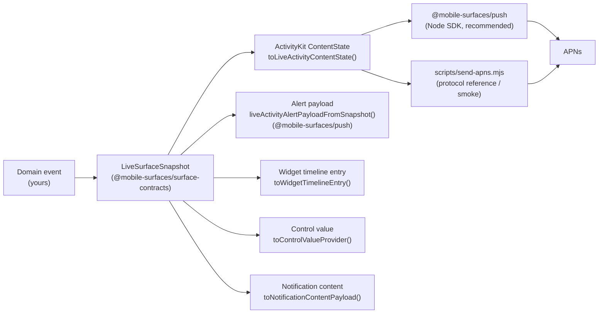

# Backend Integration

How a backend service turns a domain event into an APNs push that this starter can render.

In plain English: your backend describes what is happening once, validates that shape, and sends the right projection to Apple Push Notification service (APNs). Mobile Surfaces ships the local pieces, fixtures, the contract package, the Node SDK, the harness, and APNs smoke scripts. A real production push service is intentionally [out of scope](https://github.com/glendonC/mobile-surfaces/blob/main/README.md#what-this-is-not); the goal of this doc is to make the integration shape obvious so you can build the production half against a stable contract.

For the full push surface (token taxonomy, channel management, error responses, retry policy, smoke-script flag combinations), see [`docs/push.md`](/docs/push). This page is the high-level "how does it work end-to-end" piece; the push doc is the "how do I drive the wire layer" piece.

## Mental Model

The contract is one type with kind-gated derived shapes.



`LiveSurfaceSnapshot` is the only shape your domain code should emit. Everything else is a pure transform. The **recommended** wire-layer driver is the Node SDK at `@mobile-surfaces/push`; the **reference implementation** of the same wire shape is `scripts/send-apns.mjs`, which is intentionally self-contained so you can read the protocol top-to-bottom in one file. Both target the same APNs endpoints. See [`packages/surface-contracts/src/index.ts`](https://github.com/glendonC/mobile-surfaces/blob/main/packages/surface-contracts/src/index.ts) for the full type and projection helpers, and [`packages/push/src/client.ts`](https://github.com/glendonC/mobile-surfaces/blob/main/packages/push/src/client.ts) for the SDK client.

## Snapshot Fields

```ts
interface LiveSurfaceSnapshotBase {
  schemaVersion: "3";         // discriminator; bumped only on breaking changes
  kind: "liveActivity" | "widget" | "control" | "lockAccessory" | "standby" | "notification";
  id: string;                 // unique per snapshot revision (event-scoped)
  surfaceId: string;          // stable across snapshots for the same surface
  updatedAt: string;          // RFC 3339 datetime; required for out-of-order discard
  state: "queued" | "active" | "paused" | "attention" | "bad_timing" | "completed";
  modeLabel: string;          // human label, e.g. "queued", "active"
  contextLabel: string;       // optional sub-label, e.g. "starter"
  statusLine: string;         // single line shown in compact regions
  primaryText: string;        // headline / alert title
  secondaryText: string;      // subhead / alert body
  actionLabel?: string;       // CTA label, e.g. "Open surface"
  progress: number;           // 0..1
  deepLink: string;           // <scheme>://surface/<surfaceId>
}

// Plus per-kind slices on the matching branch:
//   kind: "liveActivity"  -> liveActivity:  { stage: "prompted" | "inProgress" | "completing"; estimatedSeconds: number; morePartsCount: number }
//   kind: "widget"        -> widget:        { family?: "systemSmall" | "systemMedium" | "systemLarge"; reloadPolicy?: "manual" | "afterDate" }
//   kind: "control"       -> control:       { kind: "toggle" | "button" | "deepLink"; state?: boolean; intent?: string }
//   kind: "notification"  -> notification:  { category?: string; threadId?: string }
//   kind: "lockAccessory" -> lockAccessory: { family: "accessoryCircular" | "accessoryRectangular" | "accessoryInline"; gaugeValue?: number; shortText?: string }
//   kind: "standby"       -> standby:       { presentation: "card" | "night"; tint?: "default" | "monochrome" }
```

`kind` selects the projection path (the schema is a true `z.discriminatedUnion("kind", …)`, invalid kind/slice combinations fail at parse time). `state` is the canonical state machine: drive the lifecycle from the backend. `liveActivity.stage` is a UI-facing axis (whether the surface is being prompted, actively running, or wrapping up); it only applies to liveActivity-kind snapshots. `progress` is independent of either.

`updatedAt` is the new required field in v2. Set it to the wall-clock instant the snapshot was authored, ideally UTC for trivial lexicographic comparison. Consumers use it to discard out-of-order pushes that ActivityKit and APNs do not order in-band; see [`schema-migration.md`](/docs/schema-migration) for the migration policy.

For a tour of every `kind` value and the projection it drives, see [`docs/multi-surface.md`](/docs/multi-surface). Look at `data/surface-fixtures/*.json` for committed examples of every state and kind.

## End-to-End Walkthrough

The motivating use case: a backend job moves through `queued → active → completed`, and you want a Live Activity on the user's Lock Screen plus a fallback alert push for anyone who has the activity disabled.

### 1. Map the domain event

Stay in your own service for this step. The output is a `LiveSurfaceSnapshot`. A minimal mapper:

```ts
import type { LiveSurfaceSnapshot } from "@mobile-surfaces/surface-contracts";

function snapshotFromJob(job: Job): LiveSurfaceSnapshot {
  const state = job.status === "queued"
    ? "queued"
    : job.status === "running"
    ? "active"
    : job.status === "done"
    ? "completed"
    : "attention";

  return {
    schemaVersion: "3",
    kind: "liveActivity",
    id: `${job.id}@${job.revision}`,
    surfaceId: `job-${job.id}`,
    updatedAt: new Date().toISOString(),
    state,
    modeLabel: state,
    contextLabel: job.queueName,
    statusLine: `${job.queueName} · ${state}`,
    primaryText: job.title,
    secondaryText: job.subtitle ?? "",
    actionLabel: "Open job",
    progress: clamp01(job.progress ?? 0),
    deepLink: `mobilesurfaces://surface/job-${job.id}`,
    liveActivity: {
      stage: state === "completed" ? "completing" : state === "queued" ? "prompted" : "inProgress",
      estimatedSeconds: job.etaSeconds ?? 0,
      morePartsCount: job.extraItems ?? 0,
    },
  };
}
```

Keep this function pure.

### 2. Validate at the wire boundary

The contract package ships two validators with different policies:

```ts
import {
  assertSnapshot,
  safeParseSnapshot,
  safeParseAnyVersion,
} from "@mobile-surfaces/surface-contracts";

// Strict v2 only. Throws ZodError on anything that isn't a current-version
// snapshot. Use this on outbound code paths where you control the producer.
const snapshot = assertSnapshot(snapshotFromJob(job));

// Strict v2 safe-parse. Returns { success, data | error }.
const result = safeParseSnapshot(input);

// Wire-edge tolerant. Tries v2 first; falls back to v1 with auto-migration
// and emits a deprecationWarning on success. Use this on inbound code paths
// (HTTP handlers, queue consumers) where producers may not have migrated to
// v2 yet. The v1 codec lives for the entire 3.x release line; see
// docs/schema-migration.md for the deprecation timeline.
const versioned = safeParseAnyVersion(input);
if (versioned.success) {
  if (versioned.deprecationWarning) {
    log.warn(versioned.deprecationWarning, { snapshotId: versioned.data.id });
  }
  // versioned.data is a LiveSurfaceSnapshot in v2 shape.
}
```

`safeParseAnyVersion` is the migration path documented in [`docs/schema-migration.md`](/docs/schema-migration). Use it whenever you read snapshots from a store that may still hold v1 payloads. (The v0 codec was removed in 3.0.0; `safeParseAnyVersion` chains v2 -> v1 only.)

The published JSON Schema at [`unpkg.com/@mobile-surfaces/surface-contracts@4.0/schema.json`](https://unpkg.com/@mobile-surfaces/surface-contracts@4.0/schema.json) is generated from the same Zod source and pinned to `major.minor`. Use it for IDE tooling, OpenAPI components, or non-TypeScript validators (Ajv, jsonschema, etc.). Standard Schema interop is automatic, every exported Zod schema implements the `~standard` getter (`{ vendor: "zod", version: 1, validate, jsonSchema }`), so the contract drops directly into Standard-Schema-aware libraries (Valibot runners, ArkType, `@standard-schema/spec`) without depending on Zod at runtime.

### 3. Send the APNs request

Use the Node SDK. One client per `(auth-key, environment, bundleId)` tuple, multiplexed across alert / Live Activity / broadcast / channel-management requests:

```ts
import { createPushClient } from "@mobile-surfaces/push";
import { toLiveActivityContentState } from "@mobile-surfaces/surface-contracts";

const push = createPushClient({
  keyId: process.env.APNS_KEY_ID!,
  teamId: process.env.APNS_TEAM_ID!,
  keyPath: process.env.APNS_KEY_PATH!,
  bundleId: process.env.APNS_BUNDLE_ID!,
  environment: "development", // or "production"
});

// Live Activity update against an existing per-activity push token.
await push.update(activityToken, snapshot);

// Live Activity remote start (iOS 17.2+) against the push-to-start token.
await push.start(pushToStartToken, snapshot, {
  surfaceId: snapshot.surfaceId,
  modeLabel: snapshot.modeLabel,
});

// End the activity. dismissalDateSeconds defaults to now.
await push.end(activityToken, snapshot);

// Alert push (uses liveActivityAlertPayloadFromSnapshot internally; works
// as a fallback for users who have Live Activities turned off).
await push.alert(deviceToken, snapshot);

await push.close(); // tear down the HTTP/2 sessions when shutting down
```

The SDK validates every snapshot through `liveSurfaceSnapshot.safeParse` and rejects non-`liveActivity` kinds for `update` / `start` / `end` / `broadcast` with a typed `InvalidSnapshotError` before any network call. `alert()`, `update()`, `start()`, `end()`, and `broadcast()` resolve with `{ apnsId, status, timestamp }`; non-2xx responses throw a typed `ApnsError` subclass per Apple reason. See [`docs/push.md`](/docs/push) for the full SDK reference, error taxonomy, and channel/broadcast surface.

#### Raw HTTP/2 reference

The SDK abstracts the wire shape, but the protocol is open. If you build the integration in a language other than Node, or you want to understand what the SDK is sending, the raw shape is below. `scripts/send-apns.mjs` builds these requests verbatim.

Live Activity update:

```
POST https://api.development.push.apple.com/3/device/<activity-token>
authorization: bearer <ES256 JWT signed with the .p8 auth key>
apns-topic: <bundle-id>.push-type.liveactivity
apns-push-type: liveactivity
apns-priority: 5                # 10 only for user-visible urgency
apns-expiration: <unix-seconds>
content-type: application/json

{
  "aps": {
    "timestamp": <unix-seconds>,
    "event": "update",
    "content-state": { "headline": "...", "subhead": "...", "progress": 0.5, "stage": "inProgress" },
    "stale-date": <optional-unix-seconds>
  }
}
```

Live Activity remote start (iOS 17.2+) requires the static attributes:

```json
{
  "aps": {
    "timestamp": 1700000000,
    "event": "start",
    "content-state": { "headline": "...", "subhead": "...", "progress": 0, "stage": "prompted" },
    "attributes-type": "MobileSurfacesActivityAttributes",
    "attributes": { "surfaceId": "...", "modeLabel": "..." },
    "stale-date": 1700003600
  }
}
```

Live Activity end:

```json
{ "aps": { "timestamp": 1700000000, "event": "end", "content-state": { ... }, "dismissal-date": 1700000060 } }
```

Alert push (the `liveActivityAlertPayloadFromSnapshot` shape):

```
apns-topic: <bundle-id>           # no push-type suffix
apns-push-type: alert
apns-priority: 10
```

```json
{
  "aps": { "alert": { "title": "...", "body": "..." }, "sound": "default" },
  "liveSurface": { "kind": "surface_snapshot", "snapshotId": "...", "surfaceId": "...", "state": "active", "deepLink": "mobilesurfaces://..." }
}
```

`liveSurface` is your sidecar. The starter does not consume it on the client; it exists so backend events and analytics share the same identifiers as the activity.

For the iOS 18 broadcast / channel-management endpoints (different host, different ports for sandbox vs production), see [`docs/push.md#environments-and-endpoints`](/docs/push#environments-and-endpoints).

### 4. Manage tokens

Three token kinds, three lifetimes. The backend is responsible for storing and rotating them. (The full lifecycle table (where each token comes from in the harness and how to store each on a backend) lives in [`docs/push.md#token-taxonomy`](/docs/push#token-taxonomy).)

- **Device APNs token**: per device, per app install. Used for plain `alert` pushes via `client.alert(deviceToken, snapshot)`. Rotates rarely. Persist by `deviceId`.
- **Push-to-start token**: per user / per `Activity<Attributes>` type, returned from `Activity<…>.pushToStartTokenUpdates` (iOS 17.2+). Used to send `event: "start"` via `client.start(pushToStartToken, snapshot, attributes)`. Subscribe at app mount and re-store whenever a new value arrives. Caveat (FB21158660, Apple-reported): a push-to-start token issued before the user force-quits the app remains valid against APNs but the OS will not actually start the activity until the user re-launches the app. There is no client workaround. Plan rollouts and customer-support scripts accordingly.
- **Per-activity push token**: returned from `Activity.pushTokenUpdates` once iOS issues it after `Activity.request`. Used for `event: "update"` / `event: "end"` via `client.update` / `client.end`. Discard the token when the activity ends.

The harness in this repo surfaces all three for inspection: the bottom row shows the device APNs token; "All active activities" shows the per-activity push token as it streams in; the push-to-start token is logged through `liveActivityAdapter`'s `onPushToStartToken` event.

## Smoke-Test The Backend Path Locally

The starter's APNs script is the protocol-reference smoke tool. It accepts the same flags a backend would set. Once you have an activity token (start one in the harness; the value streams into "All active activities"), exercise updates:

```bash
pnpm mobile:push:device:liveactivity -- \
  --activity-token=<paste> \
  --event=update \
  --state-file=./scripts/sample-state.json \
  --env=development
```

Or send the full `LiveSurfaceSnapshot`-derived state from a fixture:

```bash
pnpm mobile:push:device:liveactivity -- \
  --activity-token=<paste> \
  --event=update \
  --snapshot-file=./data/surface-fixtures/active-progress.json \
  --env=development
```

For the iOS 18 broadcast/channel modes:

```bash
# Create a channel (returns base64 channel-id)
node scripts/send-apns.mjs --channel-action=create --env=development

# Broadcast on the channel
node scripts/send-apns.mjs --type=liveactivity --channel-id=<base64> \
  --event=update --snapshot-file=./data/surface-fixtures/active-progress.json --env=development

# List / delete channels
node scripts/send-apns.mjs --channel-action=list   --env=development
node scripts/send-apns.mjs --channel-action=delete --channel-id=<base64> --env=development
```

For the full set of flags, including `--event=start`, `--push-to-start-token`, `--stale-date`, `--dismissal-date`, `--priority`, and `--storage-policy`, see [`scripts/README.md`](https://github.com/glendonC/mobile-surfaces/blob/main/scripts/README.md) and the script reference in [`docs/push.md#smoke-script-reference`](/docs/push#smoke-script-reference). When something fails, [`docs/troubleshooting.md`](/docs/troubleshooting) maps the most common APNs response codes back to causes.

## Localization Policy

All string fields on `LiveSurfaceSnapshot` are pre-rendered for one locale per snapshot. The backend selects the locale (per-user preference, request `Accept-Language`, etc.) and emits the snapshot in that locale. If the locale changes, send a fresh snapshot. There is no in-place locale switch on the client.

A future `LocalizedString` shape (e.g. `{ en: string; "es-MX"?: string }`) would arrive in a future major and bump `schemaVersion` again. v2 stays string-only on purpose; ActivityKit content states are size-bound (4 KB) and shipping every translation per push wastes that budget.

## What Stays Stable

- `LiveSurfaceSnapshot` and its TypeScript schema.
- The projection helpers (`toLiveActivityContentState`, `toWidgetTimelineEntry`, `toControlValueProvider`, `toNotificationContentPayload`) and their kind gates, plus `liveActivityAlertPayloadFromSnapshot` in `@mobile-surfaces/push`.
- The `@mobile-surfaces/push` SDK public surface (the exports listed in `packages/push/src/index.ts`). Implementation detail (HTTP/2 transport, JWT cache internals) may change without a version bump.
- The APNs topic / push-type / priority defaults emitted by the SDK and the script.

What can change without notice:

- The Swift `MobileSurfacesActivityAttributes.ContentState` shape: it must agree with `toLiveActivityContentState`'s output, but adding a field is a coordinated change in this repo.
- The smoke script's CLI flags: match the documented set in [`scripts/README.md`](https://github.com/glendonC/mobile-surfaces/blob/main/scripts/README.md), do not parse the script itself.
- The Live Activity adapter at `packages/live-activity/` (`@mobile-surfaces/live-activity`). Production backends should not depend on its internals; they depend only on the snapshot contract and APNs.
