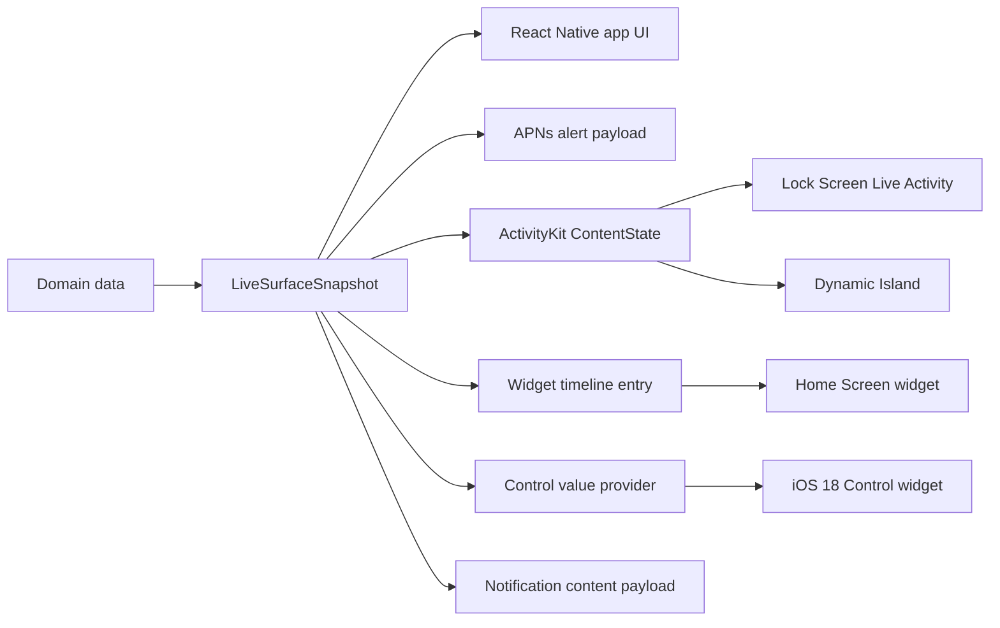

# Concepts

Mobile Surfaces is contract-first. Product data maps into one portable `LiveSurfaceSnapshot`; every surface derives its own view or payload from that snapshot through a `kind`-gated projection helper. The starter ships a specific native implementation, but the snapshot contract is the stable boundary.



## Starter identity

The starter identity is intentionally generic:

- App name: `Mobile Surfaces`
- URL scheme: `mobilesurfaces`
- Example bundle id: `com.example.mobilesurfaces`
- Widget target: `MobileSurfacesWidget`

## Native implementation

The starter uses a local Expo ActivityKit module wrapped behind an adapter contract, with `@bacons/apple-targets` generating and linking the WidgetKit target during Expo prebuild. The module is purpose-built: start, update, list, and end ActivityKit activities, plus push token and state events. `@bacons/apple-targets` keeps SwiftUI widget source in `apps/mobile/targets/widget/`, outside the generated `apps/mobile/ios/`, which fits Continuous Native Generation.

An adapter boundary around Live Activity operations means a future branch can swap the local module for `expo-live-activity` or another bridge without changing fixtures, docs, or product mapping code. The harness imports the adapter from `apps/mobile/src/liveActivity/index.ts` as `liveActivityAdapter`. That re-export is the stable swap point: a future swap is a one-file edit here plus a shim that conforms to `LiveActivityAdapter` (see [Adapter Contract](#adapter-contract)). No call site under `apps/mobile/src/` imports from `@mobile-surfaces/live-activity` directly. The boundary is enforced by `scripts/check-adapter-boundary.mjs` (MS001).

## Adapter contract

The contract is the `LiveActivityAdapter` interface exported from `@mobile-surfaces/live-activity` (defined in `packages/live-activity/src/index.ts`). The local Expo native module is constrained with `implements LiveActivityAdapter`, and the harness re-export at `apps/mobile/src/liveActivity/index.ts` types its runtime value as `LiveActivityAdapter`, so the contract and the implementations cannot drift in opposite directions without `tsc` complaining.

The shape, reproduced here for reference (the source in `packages/live-activity/src/index.ts` is canonical):

```ts
import type {
  LiveSurfaceActivityContentState,
  LiveSurfaceStage,
} from "@mobile-surfaces/surface-contracts";

export type LiveActivityStage = LiveSurfaceStage;
export type LiveActivityContentState = LiveSurfaceActivityContentState;

export interface LiveActivitySnapshot {
  id: string;
  surfaceId: string;
  modeLabel: string;
  state: LiveActivityContentState;
  pushToken: string | null;
}

export interface LiveActivityChannelStartResult {
  id: string;
  state: LiveActivityContentState;
  channelId: string;
}

export type LiveActivityEvents = {
  onPushToken: (payload: { activityId: string; token: string }) => void;
  onActivityStateChange: (payload: {
    activityId: string;
    state: "active" | "ended" | "dismissed" | "stale" | "pending" | "unknown";
  }) => void;
  // iOS 17.2+ per-app push-to-start credential. Distinct from the per-activity
  // token emitted by onPushToken. Tokens may arrive at any time (cold launch,
  // system rotation, foreground); subscribe in a mount-time effect.
  onPushToStartToken: (payload: { token: string }) => void;
};

export interface LiveActivityAdapter {
  areActivitiesEnabled(): Promise<boolean>;
  // Pass channelId to opt into iOS 18+ broadcast push (pushType: .channel(...)).
  // The native side echoes channelId back only when channel mode actually
  // engaged; iOS < 18 throws ACTIVITY_UNSUPPORTED_FEATURE rather than degrading.
  start(
    surfaceId: string,
    modeLabel: string,
    state: LiveActivityContentState,
    channelId?: string | null,
  ): Promise<{
    id: string;
    state: LiveActivityContentState;
    channelId?: string;
  }>;
  update(activityId: string, state: LiveActivityContentState): Promise<void>;
  end(
    activityId: string,
    dismissalPolicy: "immediate" | "default",
  ): Promise<void>;
  listActive(): Promise<LiveActivitySnapshot[]>;
  // Returns the most recent push-to-start token cached from the
  // onPushToStartToken stream, or null if none has been observed yet on
  // this bridge session. Subscribe to the event in a mount-time effect
  // rather than polling.
  getPushToStartToken(): Promise<string | null>;
  addListener<E extends keyof LiveActivityEvents>(
    event: E,
    handler: LiveActivityEvents[E],
  ): { remove(): void };
}
```

Six async methods (`areActivitiesEnabled`, `start`, `update`, `end`, `listActive`, `getPushToStartToken`) plus three events (`onPushToken`, `onActivityStateChange`, `onPushToStartToken`). Adding to this surface counts as a breaking change; all adapters and the harness must update together.

## ActivityKit terminology

Three Swift types in the ActivityKit story look interchangeable but are not:

- `MobileSurfacesActivityAttributes` — the static `ActivityAttributes` keyed by the widget extension. Identity fields only (`surfaceId`, `modeLabel`). Lives in two Swift files (MS002) that are generated byte-identical from the Zod source via `scripts/generate-activity-attributes.mjs`, so the host module and the widget target both see the same shape.
- `MobileSurfacesActivityAttributes.ContentState` — the per-update payload ActivityKit decodes from each push `content-state` JSON. This is what `toLiveActivityContentState` projects into and what the Zod `liveSurfaceActivityContentState` describes. MS003 enforces field-and-JSON-key parity.
- `ActivityContent<ContentState>` — Apple's wrapper, carries `state`, optional `staleDate`, and optional `relevanceScore`. The bridge unwraps it before passing the decoded state across the JS bridge, so JS consumers see `ContentState` directly. The native `update()` and `start()` plumbing both thread `staleDateSeconds` and `relevanceScore` through this wrapper when the caller supplies them; the push wire layer also writes them into the APNs `aps` envelope (`aps.stale-date`, `aps.relevance-score`).

When this site says "ContentState" it means the inner shape. When push docs say "`stale-date`" they mean the APNs `aps` key; iOS reads it equivalently to `ActivityContent.staleDate` for delivery purposes.

## Live Activity lifecycle ceilings

ActivityKit enforces ceilings on how long an activity can live. The SDK accepts any positive unix-seconds value for `staleDateSeconds` and `dismissalDateSeconds`; iOS clamps to its own ceiling at delivery time.

| iOS version | Default active window | Max staleDate window | Max dismissalDate window |
| --- | --- | --- | --- |
| 16.2 – 17.x | 8 hours | 8 hours after start | 4 hours after end |
| 18+ (typed app) | 8 hours | 8 hours after start | 8 hours after end (relaxed) |
| 18+ (channel) | per-channel storage policy | n/a (broadcast scope) | n/a |

`updatedAt` on the snapshot is a business-event timestamp the contract uses for out-of-order deduplication at the host → APNs boundary; it is not the ActivityKit stale-date. Set `staleDateSeconds` explicitly when you want iOS to grey the activity out before its 8-hour default.

## Contract rules

Domain objects do not flow directly into ActivityKit or APNs payloads. Convert them first:

```ts
import {
  toLiveActivityContentState,
  toWidgetTimelineEntry,
  toControlValueProvider,
} from "@mobile-surfaces/surface-contracts";
import { toApnsAlertPayload } from "@mobile-surfaces/push";

const snapshot = mapDomainEventToLiveSurfaceSnapshot(event);
const activityState = toLiveActivityContentState(snapshot);
const widgetEntry = toWidgetTimelineEntry(snapshot);
const controlValue = toControlValueProvider(snapshot);
const alertPayload =
  snapshot.kind === "liveActivity"
    ? toApnsAlertPayload(snapshot)
    : undefined;
```

This keeps app-specific data models free to change while the app UI, alert pushes, ActivityKit content state, Lock Screen, Dynamic Island, widgets, controls, and notification content projections agree on one portable surface shape. Projection helpers are `kind`-gated: a `widget` snapshot cannot be accidentally sent through the Live Activity projection.

Widget and control snapshots move through the shared App Group declared in `apps/mobile/app.json` and mirrored into `apps/mobile/targets/widget/expo-target.config.js`. The app writes projected JSON under `surface.snapshot.<surfaceId>`, points `surface.widget.currentSurfaceId` / `surface.control.currentSurfaceId` at the active entries, then requests WidgetKit and Control Center reloads.

## Native constraints

ActivityKit and WidgetKit impose important limits:

- A Live Activity is active for up to 8 hours, then may remain on the Lock Screen for up to 4 more hours.
- Static and dynamic ActivityKit data must stay within Apple's 4 KB payload limit.
- Live Activities cannot fetch network data directly; update through the app or ActivityKit push notifications.
- Home-screen widgets and control widgets read shared App Group state; an entitlement mismatch between the host app and extension makes them fall back to placeholder state.
- Dynamic Island is only available on supported iPhone Pro models; the Lock Screen is the primary surface.
- APNs Live Activity updates have system budgets. Prefer low priority updates unless the user needs immediate attention.

## Validation

Run:

```bash
pnpm surface:check
```

The flow:

1. **Zod is the single source of truth.** `packages/surface-contracts/src/schema.ts` defines `liveSurfaceSnapshot` as a true `z.discriminatedUnion("kind", […])` with six members (`liveActivity`, `widget`, `control`, `lockAccessory`, `standby`, `notification`). Per-kind slices are strict objects attached to their respective branches; v4 (5.0) finished the slice-per-kind transition by collapsing the base to identity-only. TypeScript types are inferred from the schema; there is no second hand-written interface to drift.
2. **JSON Schema is generated.** `scripts/build-schema.mjs` calls `z.toJSONSchema` and writes the result to `packages/surface-contracts/schema.json`. The output is `oneOf` with `const`-discriminated branches, so external validators (Ajv, jsonschema, OpenAPI tooling) get proper kind ↔ slice enforcement out of the box. `surface:check` runs the generator with `--check` so a stale committed file fails CI.
3. **Fixtures are validated by the same Zod schema.** `scripts/validate-surface-fixtures.mjs` parses every JSON under `data/surface-fixtures/` through `liveSurfaceSnapshot.safeParse`. Fixtures carry a `$schema` pointer for IDE tooling; the validator strips it before parsing because the wire payload itself never carries `$schema`.
4. **Generated TypeScript fixtures are checked for drift** against the JSON via `scripts/generate-surface-fixtures.mjs --check`.
5. **Adapter boundary is enforced.** `scripts/check-adapter-boundary.mjs` fails if anything under `apps/mobile/src/` imports `@mobile-surfaces/live-activity` directly instead of going through the `apps/mobile/src/liveActivity/index.ts` re-export.
6. **Duplicated ActivityKit attribute files** are generated from Zod, enforced by two gates:
   - `packages/live-activity/ios/MobileSurfacesActivityAttributes.swift`
   - `apps/mobile/targets/widget/MobileSurfacesActivityAttributes.swift`

   Both files are emitted by `scripts/generate-activity-attributes.mjs` from `liveSurfaceActivityContentState` and `liveSurfaceStage` in `packages/surface-contracts/src/schema.ts`. `surface:check` gates the codegen with `--check` at stage 2 (drift fails CI), and `scripts/check-activity-attributes.mjs` at stage 3 redoes the byte-identity + Zod parity check as defense in depth.

### Staleness signals

Projection-output schemas (widget timeline entry, control value provider, lock-accessory entry, standby entry) carry no temporal field by design. The host app writes a `writtenAt` sibling key alongside each snapshot JSON in the App Group container — a transport-layer wall clock — and the widget extension reads it to compute a staleness hint when the host process is no longer alive to refresh the timeline. The snapshot's own `updatedAt` is a business-event timestamp used at the host → APNs boundary for out-of-order deduplication; it is intentionally separate from the transport breadcrumb so MS036 (Swift struct ↔ Zod projection parity) stays clean. See `apps/mobile/targets/_shared/MobileSurfacesSharedState.swift:31-37` for the writer-side key derivation and `apps/mobile/src/surfaceStorage/index.ts:24-31` for the host-side write path.

### Schema evolution

`LiveSurfaceSnapshot` carries a `schemaVersion: "5"` literal and a top-level `kind` discriminator. The union is strict. The codec chain in `safeParseAnyVersion` covers v3 → v4 → v5 today; the deprecation schedule and migration policy live in [`schema.md`](/docs/schema).

- **The union is strict.** `z.discriminatedUnion("kind", [...])` over six branches; every branch carries its own `.strict()` slice, and unknown keys reject. Cross-kind projection fails at parse time and again at the `assertSnapshotKind` runtime narrow.
- **`kind` must be set explicitly.** v1 had a `.preprocess()` shim that defaulted missing-kind payloads to `"liveActivity"`; v2 removed it and every later version keeps it removed.
- **Bump `schemaVersion` only on a breaking change.** Renaming a field, removing a field, changing a type, tightening a constraint, or anything that would make a previously valid payload fail to parse. Additive optional fields are non-breaking.
- **The schema URL pins to the package major.** `scripts/build-schema.mjs` derives the `$id` from the surface-contracts `package.json` version (`https://unpkg.com/@mobile-surfaces/surface-contracts@7.0/schema.json`).

### Standard Schema interop

Zod 4.x implements [Standard Schema](https://standardschema.dev) on every exported schema. `liveSurfaceSnapshot["~standard"]` returns `{ vendor: "zod", version: 1, validate, jsonSchema }`, so consumers can pass the contract to any Standard-Schema-aware library (Valibot, ArkType, `@standard-schema/spec` runners) without depending on Zod at runtime. A live test in `packages/surface-contracts` pins this. See [`schema.md`](/docs/schema) for a Valibot-style consumer example.

### Linked release group

`.changeset/config.json` links `@mobile-surfaces/surface-contracts`, `@mobile-surfaces/validators`, and `@mobile-surfaces/traps` so they always release at the same version. The full versioning policy — what counts as a major, the deprecation timeline, the `workspace:*` vs `workspace:^` convention — lives in [`stability.md`](/docs/stability).
