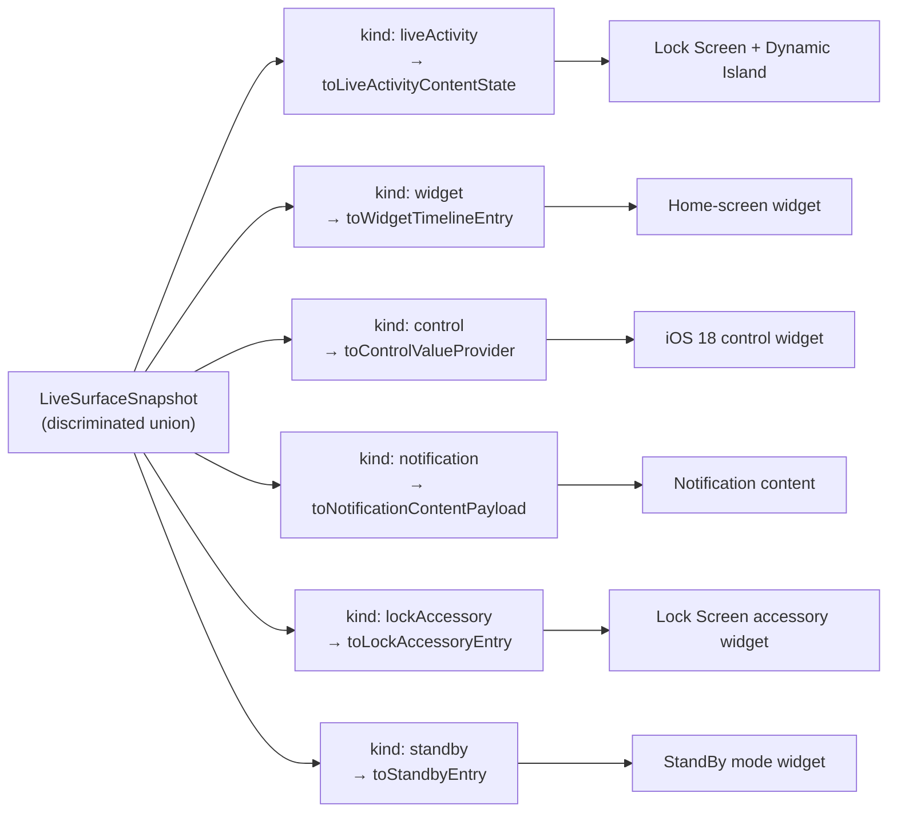

# Surfaces

`LiveSurfaceSnapshot` is one shape with a `kind` discriminator. Every iOS surface (Lock Screen Live Activity, Dynamic Island, home-screen widget, iOS 18 control widget, notification, lock-screen accessory, StandBy) derives its render input from the same snapshot through a `kind`-gated projection helper. This page walks every `kind` value, what it represents on iOS, what ships today, and how a backend would emit it.

For the high-level integration tour, see [`docs/backend.md`](/docs/backend). For the wire layer (SDK + smoke script + APNs reference), see [`docs/push.md`](/docs/push). For the schema-evolution policy, see [`docs/schema.md`](/docs/schema).

## What ships today

| Surface | Status | Native target |
| --- | --- | --- |
| Lock Screen Live Activity | Shipped | `MobileSurfacesLiveActivity.swift` |
| Dynamic Island | Shipped | Same (ActivityKit renders both from one `Activity`) |
| Home-screen widget | Shipped | `MobileSurfacesHomeWidget.swift` |
| iOS 18 control widget | Shipped | `MobileSurfacesControlWidget.swift` + shared App Intents |
| Lock Screen accessory | Shipped | `MobileSurfacesLockAccessoryWidget.swift` |
| StandBy widget | Shipped | `MobileSurfacesStandbyWidget.swift` |
| Push notification (basic alert) | Shipped | `client.sendNotification(...)` projects through `toNotificationContentPayload` |
| Notification content extension (custom expanded layout) | Shipped | `MobileSurfacesNotificationViewController.swift` renders payload-only via the `liveSurface` sidecar; categories codegened from `notificationCategories.ts` (MS037) |
| Notification service extension (enrichment, attachments) | Deferred — see [Deferred extensions](#deferred-extensions) |  |

Every shipped surface renders from the same `LiveSurfaceSnapshot`. They cannot drift, because they all project from one source.

## The contract is one shape

```ts
import {
  liveSurfaceSnapshot,                  // z.discriminatedUnion("kind", […])
  liveSurfaceSnapshotLiveActivity,
  liveSurfaceSnapshotWidget,
  liveSurfaceSnapshotControl,
  liveSurfaceSnapshotNotification,
  liveSurfaceSnapshotLockAccessory,
  liveSurfaceSnapshotStandby,
} from "@mobile-surfaces/surface-contracts";
```

`liveSurfaceSnapshot` is a true `z.discriminatedUnion("kind", […])` over six branches at `schemaVersion: "5"`. The base fields shared across every branch are deliberately minimal: `id`, `surfaceId`, `kind`, `updatedAt`, and `state`. Every rendering field (title/body, modeLabel, contextLabel, statusLine, progress, deepLink, actionLabel, control label) lives inside the per-kind slice for the kind that actually uses it; the base only carries identity and lifecycle. Each branch carries its own slice: `liveActivity` adds `{ title, body, progress, deepLink, modeLabel, contextLabel, statusLine, actionLabel?, stage, estimatedSeconds, morePartsCount }`; `widget`, `control`, `notification`, `lockAccessory`, and `standby` each carry their own surface-specific shape documented per-kind below.



Projection helpers are kind-gated: `toLiveActivityContentState` rejects a `widget`-kind snapshot at runtime, `toWidgetTimelineEntry` rejects a `liveActivity`-kind snapshot, etc. (see `assertSnapshotKind` in `packages/surface-contracts/src/index.ts`). The discriminated union also makes invalid kind/slice combinations unparseable up front; a `kind: "control"` snapshot without a `control` slice fails at `liveSurfaceSnapshot.safeParse`.

## `kind: "liveActivity"`

The default. Renders as a Lock Screen Live Activity and Dynamic Island compact / minimal / expanded regions through the WidgetKit extension.

**Status: shipped.** Eight fixtures cover the state machine:

- `data/surface-fixtures/queued.json`: initial state, `progress: 0`.
- `data/surface-fixtures/attention.json`: alert-worthy, `state: "attention"`.
- `data/surface-fixtures/active-progress.json`: running, `progress: 0.5`.
- `data/surface-fixtures/active-countdown.json`: running, time-sensitive.
- `data/surface-fixtures/active-details.json`: running, `liveActivity.morePartsCount: 2`.
- `data/surface-fixtures/paused.json`: paused without noisy updates.
- `data/surface-fixtures/bad-timing.json`: suppressed, `state: "bad_timing"`.
- `data/surface-fixtures/completed.json`: done, `state: "completed"`, `progress: 1`.

Projection helpers: `toLiveActivityContentState` (in `@mobile-surfaces/surface-contracts`; returns `{ headline, subhead, progress, stage }`) and `toApnsAlertPayload` (in `@mobile-surfaces/push`; returns the APNs alert + `liveSurface` sidecar). The alert helper lives next to the wire-layer SDK that emits it.

Native: `apps/mobile/targets/widget/MobileSurfacesLiveActivity.swift` declares the `ActivityConfiguration(for: MobileSurfacesActivityAttributes.self)`. `MobileSurfacesActivityAttributes.swift` is duplicated byte-for-byte across the Expo module (`packages/live-activity/ios/`) and the widget target; `scripts/check-activity-attributes.mjs` enforces the byte-identity. The duplication is mitigated by codegen from a single Zod source; eliminating it entirely waits on upstream Swift Package support.

### When to emit

- A backend job (rendering, payment, fulfillment) that the user wants to track in real time.
- Anything that fits the ActivityKit lifetime ceiling: 8 active hours + 4 hours stale.
- The user has Live Activities enabled. Send a `kind: "liveActivity"` push and a fallback `alert` (also derived from the same snapshot via `toApnsAlertPayload`) for users who have them disabled.

### Code example

```ts
import {
  assertSnapshot,
  toLiveActivityContentState,
  type LiveSurfaceSnapshot,
} from "@mobile-surfaces/surface-contracts";
import { createPushClient } from "@mobile-surfaces/push";

function snapshotFromJob(job: Job): LiveSurfaceSnapshot {
  return {
    schemaVersion: "5",
    kind: "liveActivity",
    id: `${job.id}@${job.revision}`,
    surfaceId: `job-${job.id}`,
    updatedAt: new Date().toISOString(),
    state: job.status === "done" ? "completed" : "active",
    liveActivity: {
      title: job.title,
      body: job.subtitle ?? "",
      progress: job.progress,
      deepLink: `mobilesurfaces://surface/job-${job.id}`,
      modeLabel: "active",
      contextLabel: job.queueName,
      statusLine: `${job.queueName} · ${Math.round(job.progress * 100)}%`,
      actionLabel: "Open job",
      stage: job.status === "done" ? "completing" : "inProgress",
      estimatedSeconds: job.etaSeconds ?? 0,
      morePartsCount: 0,
    },
  };
}

const snapshot = assertSnapshot(snapshotFromJob(job));
const contentState = toLiveActivityContentState(snapshot);
// → { headline: "...", subhead: "...", progress: 0.5, stage: "inProgress" }

const push = createPushClient({ /* ... */ });
await push.update(activityToken, snapshot);
```

Smoke equivalent:

```bash
pnpm mobile:push:device:liveactivity -- \
  --activity-token=<hex> \
  --event=update \
  --snapshot-file=./data/surface-fixtures/active-progress.json \
  --env=development
```

## `kind: "widget"`

A home-screen widget timeline entry. The widget extension reads the latest entry from the shared App Group and renders it through `MobileSurfacesHomeWidget`.

**Status: shipped.** One fixture: `data/surface-fixtures/widget-dashboard.json`. Projection helper: `toWidgetTimelineEntry` (returns `{ kind, snapshotId, surfaceId, state, family, reloadPolicy, headline, subhead, progress, deepLink }`). Native target: `apps/mobile/targets/widget/MobileSurfacesHomeWidget.swift`. The `widget` slice supports `family: "systemSmall" | "systemMedium" | "systemLarge"` and `reloadPolicy: "manual" | "afterDate"`.

### Storage path

Widget snapshots flow through the shared App Group (`group.com.example.mobilesurfaces`) keyed on `surface.snapshot.<surfaceId>`. The pointer at `surface.widget.currentSurfaceId` selects which snapshot the widget renders. See `apps/mobile/src/surfaceStorage/index.ts` for the keys.

### When to emit

- A persistent home-screen surface with a known reload cadence.
- A surface whose state changes are too slow for a Live Activity but should still propagate without a network round-trip.
- Multi-family widgets where the same snapshot drives small / medium / large renders; the `widget.family` field is a hint that lets the timeline entry carry the chosen size.

### Code example

```ts
import {
  surfaceFixtureSnapshots,
  toWidgetTimelineEntry,
} from "@mobile-surfaces/surface-contracts";

const snapshot = surfaceFixtureSnapshots.widgetDashboard;
const entry = toWidgetTimelineEntry(snapshot);
// → {
//     kind: "widget",
//     snapshotId: "fixture-widget-dashboard",
//     surfaceId: "surface-widget-dashboard",
//     state: "active",
//     family: "systemMedium",
//     reloadPolicy: "manual",
//     headline: "Widget surface synced",
//     subhead: "This snapshot is written through the App Group and rendered by the home-screen widget.",
//     progress: 0.62,
//     deepLink: "mobilesurfaces://surface/surface-widget-dashboard",
//   }
```

Widget surfaces do not flow through APNs directly; they update via App Group writes from the host app and a WidgetKit reload. A backend that wants to drive widget state remotely pushes a regular alert containing the snapshot, then the host app projects it through `toWidgetTimelineEntry` and writes it through `surfaceStorage`.

## `kind: "control"`

The iOS 18 control widget surface (Control Center / Lock Screen control). Renders a toggle, button, or deep-link control that calls back into the app via App Intents.

**Status: shipped (iOS 18+).** One fixture: `data/surface-fixtures/control-toggle.json`. Projection helper: `toControlValueProvider` (returns `{ kind, snapshotId, surfaceId, controlKind, value, intent, label, deepLink }`). Native target: `apps/mobile/targets/widget/MobileSurfacesControlWidget.swift` plus the shared App Intents in `apps/mobile/targets/_shared/MobileSurfacesControlIntents.swift`. The `control` slice supports `kind: "toggle" | "button" | "deepLink"`, `state?: boolean` (for toggles), and `intent?: string` (the App Intent identifier).

### Storage path

Control snapshots use the same App Group as widgets, with `surface.control.currentSurfaceId` selecting the active control snapshot.

### When to emit

- An iOS 18+ surface with a single primitive interaction (toggle, button, deep-link).
- State that the user can flip without unlocking the device.
- Anything backed by an `AppIntent` shared between the app and the widget extension. The control widget calls the intent; the app reflects the result back through `surfaceStorage`.

iOS < 18 has no control widget. Older OS versions still build the snapshot fine; the widget extension simply does not register the control widget.

### Code example

```ts
import {
  surfaceFixtureSnapshots,
  toControlValueProvider,
} from "@mobile-surfaces/surface-contracts";

const snapshot = surfaceFixtureSnapshots.controlToggle;
const value = toControlValueProvider(snapshot);
// → {
//     kind: "control",
//     snapshotId: "fixture-control-toggle",
//     surfaceId: "surface-control-toggle",
//     controlKind: "toggle",
//     value: false,
//     intent: "toggleSurface",
//     label: "Surface toggle",          // control.label (required in v4)
//     deepLink: "mobilesurfaces://surface/surface-control-toggle",
//   }
```

Control surfaces, like widgets, do not flow through APNs directly. The host app writes the projected value into the shared App Group, then requests a Control Center reload.

## `kind: "notification"`

A notification content payload. Drives the standard alert UI on the Lock Screen / Notification Center, with optional `subtitle`, `category`, `threadId`, `interruptionLevel`, `relevanceScore`, and `targetContentId` slots.

**Status: shipped.** Eight fixtures cover the slice's expressive range:

- `data/surface-fixtures/notification-alert.json`: plain transactional alert, `state: "attention"`.
- `data/surface-fixtures/notification-category-routed.json`: routes to the bundled `UNNotificationContentExtension` via `category: "surface-update"`.
- `data/surface-fixtures/notification-thread-grouped.json`: thread grouping via `threadId`, no category.
- `data/surface-fixtures/notification-time-sensitive.json`: `interruptionLevel: "timeSensitive"` for Focus-mode-breaking delivery.
- `data/surface-fixtures/notification-relevance-summary.json`: `relevanceScore` for grouped-summary ranking.
- `data/surface-fixtures/notification-completed.json`: terminal `state: "completed"`.
- `data/surface-fixtures/notification-subtitle.json`: `subtitle` between title and body.
- `data/surface-fixtures/notification-deep-link-window.json`: `targetContentId` for window-scene routing.

Projection helper: `toNotificationContentPayload` (returns the APNs envelope plus a `liveSurface` sidecar typed as `liveSurfaceNotificationContentEntry`). Sidecar discriminator: `kind: "surface_snapshot"`, aligned with the liveActivity alert payload's sidecar so on-device routing code can switch on one literal regardless of which Mobile Surfaces wrapper produced the userInfo.

Native target: `apps/mobile/targets/notification-content/MobileSurfacesNotificationViewController.swift`. The extension renders payload-only: it decodes the `liveSurface` sidecar from `notification.request.content.userInfo` and shows a SwiftUI body next to the standard alert chrome. It does **not** read from the App Group container; that path would only be reliable behind a `UNNotificationServiceExtension` upstream (canonical Apple enrichment pattern) — see [Deferred extensions](#deferred-extensions).

The SDK sends via `client.sendNotification(deviceToken, snapshot)`; APNs push-type is `alert`, priority 10, bare-bundle-id `apns-topic`. The 4 KB alert ceiling applies (MS011); the 5 KB allowance is ActivityKit-broadcast-only.

### Category routing

`notification.category` is the iOS routing key. The schema constrains it to the registry in `packages/surface-contracts/src/notificationCategories.ts` (canonical source) via `z.enum`. The host registers every category at app launch through `registerNotificationCategories()` (calls `Notifications.setNotificationCategoryAsync`). The extension's `Info.plist` `UNNotificationExtensionCategory` array is codegened from the same source. All four sites stay in lockstep via `pnpm surface:codegen` (trapId MS037).

The reference architecture ships **one** category — `surface-update` — with zero action buttons. Action-button wiring is purely additive: extend the registry, regenerate, and the host's response delegate gates on `action.identifier`.

### When to emit

- A surface that should appear in Notification Center even when the user has Live Activities disabled.
- A grouped notification thread (`threadId`) that should aggregate with related notifications from the same flow.
- Time-sensitive notifications that need to break through Focus (`interruptionLevel: "timeSensitive"`).
- Category-routed notifications that need custom rendering via the bundled content extension.

### Code example

```ts
import {
  toNotificationContentPayload,
  type LiveSurfaceSnapshot,
} from "@mobile-surfaces/surface-contracts";
import { createPushClient } from "@mobile-surfaces/push";

const snapshot: LiveSurfaceSnapshot = {
  schemaVersion: "5",
  kind: "notification",
  id: "notif-42",
  surfaceId: "surface-job-42",
  updatedAt: new Date().toISOString(),
  state: "attention",
  notification: {
    title: "Order ready",
    subtitle: "Pickup window closes at 6 PM",
    body: "Tap to open the order.",
    deepLink: "mobilesurfaces://surface/surface-job-42",
    category: "surface-update",
    threadId: "orders-42",
    interruptionLevel: "timeSensitive",
  },
};

const payload = toNotificationContentPayload(snapshot);
// → {
//     aps: {
//       alert: { title: "Order ready", subtitle: "Pickup window closes at 6 PM", body: "Tap to open the order." },
//       sound: "default",
//       category: "surface-update",
//       "thread-id": "orders-42",
//       "interruption-level": "timeSensitive",
//     },
//     liveSurface: { kind: "surface_snapshot", snapshotId: "notif-42", surfaceId: "surface-job-42", state: "attention", deepLink: "...", category: "surface-update" },
//   }

const push = createPushClient({ /* ... */ });
await push.sendNotification(deviceApnsToken, snapshot);
```

## `kind: "lockAccessory"`

A lock-screen accessory widget (the inline / circular / rectangular Lock Screen complications introduced in iOS 16). Renders next to the clock.

**Status: shipped, lighter slice than `widget`/`control`.** The contract parses cleanly via `liveSurfaceSnapshotLockAccessory`, `toLockAccessoryEntry` projects to the consumer shape (`family`, `shortText` as an optional compact label, `gaugeValue` as an optional 0..1 fill), the `lock-accessory-circular.json` fixture exercises it, and `MobileSurfacesLockAccessoryWidget` renders it on device. The slice carries less than `widget`/`control` because the Lock Screen accessory families are themselves constrained — there is intentionally no rich glyph or detail-rows surface here.

### When to emit

- Persistent at-a-glance state that should sit next to the clock without animation.
- Lock-screen complications where a Live Activity is overkill (no countdown, no progress animation).

### Code example

```ts
import { liveSurfaceSnapshotLockAccessory } from "@mobile-surfaces/surface-contracts";

const parsed = liveSurfaceSnapshotLockAccessory.parse({
  schemaVersion: "5",
  kind: "lockAccessory",
  id: "accessory-1",
  surfaceId: "surface-status",
  updatedAt: new Date().toISOString(),
  state: "active",
  lockAccessory: {
    title: "Online",
    deepLink: "mobilesurfaces://surface/surface-status",
    family: "accessoryCircular",
  },
});
// Renders on device through MobileSurfacesLockAccessoryWidget.
```

## `kind: "standby"`

The iOS 17+ StandBy mode (large idle clock view when the phone is charging on its side). Renders existing widget content with a different rendering hint.

**Status: shipped, intentionally minimal slice.** `liveSurfaceSnapshotStandby` parses and validates, `toStandbyEntry` projects to the consumer shape (`presentation`, `tint`, `headline`, `subhead`, `progress`), the `standby-card.json` fixture demonstrates it, and `MobileSurfacesStandbyWidget` renders it on device with day/night-aware backgrounds and a monochrome tint mode. The slice carries `title`, `body`, `progress`, `deepLink`, `presentation`, and an optional `tint`; the rendering-hint axes (`presentation`, `tint`) are what make StandBy distinct from a plain widget.

### When to emit

- A widget that should render distinctly when the device is in StandBy (high-contrast, glanceable, dim-friendly).

### Code example

```ts
import { liveSurfaceSnapshotStandby } from "@mobile-surfaces/surface-contracts";

const parsed = liveSurfaceSnapshotStandby.parse({
  schemaVersion: "5",
  kind: "standby",
  id: "standby-1",
  surfaceId: "surface-clock",
  updatedAt: new Date().toISOString(),
  state: "active",
  standby: {
    title: "12:34",
    body: "",
    progress: 1,
    deepLink: "mobilesurfaces://surface/surface-clock",
    presentation: "card",
  },
});
// Renders on device through MobileSurfacesStandbyWidget.
```

## Cross-cutting concerns

### `surfaceId` vs `id`

- **`surfaceId` is stable across snapshots** for the same surface. It is the identity a backend uses to update an existing Lock Screen activity, address an App Group entry (`surface.snapshot.<surfaceId>`), or correlate analytics. Pick a deterministic, namespaced value (`job-${jobId}`, `room-${roomId}`).
- **`id` is per-snapshot-revision.** It changes every time the snapshot's contents change. Useful for idempotent push delivery (an APNs request with `apns-id` derived from `id` is safe to retry without duplicating the user-visible update).

A typical pattern: `id = ${surfaceId}@${revision}` where `revision` is your domain object's version.

### `deepLink` and the iOS scheme

`deepLink` is validated as a URL with a scheme prefix (`/^[a-z][a-z0-9+\-.]*:\/\//`). The starter ships with the `mobilesurfaces://` scheme by default; rename via `pnpm surface:rename` (which patches `apps/mobile/app.json`'s `expo.scheme` and the Swift constants). Examples:

- `mobilesurfaces://surface/surface-active-progress`: open the surface detail view.
- `mobilesurfaces://today`: used by `data/surface-fixtures/bad-timing.json` to land on a non-surface destination when the surface is suppressed.
- `mobilesurfaces://settings`: anything; the host app routes it.

The `deepLink` field is propagated into every projection: it lands in `LiveActivityAlertPayload.liveSurface.deepLink` (from `@mobile-surfaces/push`), `LiveSurfaceWidgetTimelineEntry.deepLink`, `LiveSurfaceControlValueProvider.deepLink`, and the notification sidecar. The widget extension uses it as the `widgetURL(_:)` value; tapping the widget opens the host app to that scheme.

### Picking the right `kind` for a backend event

| Domain situation | Recommended `kind` |
| --- | --- |
| Long-running task with progress; user wants real-time updates | `liveActivity` (with fallback `liveActivity` -> `toApnsAlertPayload` for users who have activities disabled) |
| Persistent status visible at a glance, infrequent updates | `widget` |
| Single-tap interaction reachable from Control Center / Lock Screen | `control` |
| Standalone notification with category / thread routing | `notification` |
| Lock Screen complication next to the clock | `lockAccessory` |
| StandBy-specific rendering hint | `standby` |

A single domain event can fan out to multiple kinds; emit one snapshot per surface the user has opted in to. The base fields (`id`, `surfaceId`, `kind`, `updatedAt`, `state`) stay equivalent across kinds; only the per-kind slice and the projection helper change.

## Deferred extensions

The notification surface ships `kind: "notification"`, the `toNotificationContentPayload` projection helper, the `client.sendNotification` SDK method, and a bundled `UNNotificationContentExtension` (`apps/mobile/targets/notification-content/`) that renders custom expanded content for category-routed notifications. What is intentionally not in the starter is the `UNNotificationServiceExtension` (a separate Apple extension type, `com.apple.usernotifications.service`) that intercepts a push before delivery to enrich its content. The service extension is the canonical Apple path when enrichment cannot fit in the 4 KB alert payload (image attachments, on-device personalization, E2E-decrypted content). Adding it later is purely additive: a sibling `apps/mobile/targets/notification-service/` directory, a `mutable-content: 1` flag on the wire, and an App-Group write path the content extension can read. The bundled content extension is already structured to fall back to payload-only rendering when no enrichment record exists, so the service extension can land independently without changing existing call sites.

Two notification-surface features were also deliberately held for a deliberate RFC rather than bolted on:

- **Attachments** (`UNNotificationAttachment`). Image, video, or audio enrichment served via URL or App Group file. Requires a `UNNotificationServiceExtension` to fetch and attach. The slice is shaped to extend non-breakingly when the time comes.
- **Localized strings** (`aps.alert.title-loc-key`, `loc-args`, etc.). Changes the projection-output shape (the `aps.alert` block becomes a union of plain vs localized variants).
