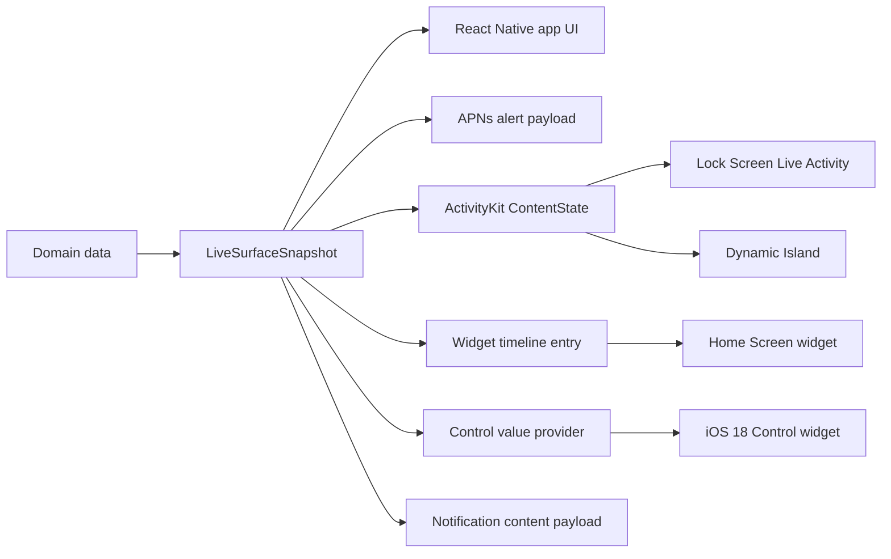

# Architecture

Mobile Surfaces is contract-first. Product data should map into one portable `LiveSurfaceSnapshot`; every surface then derives its own view or payload from that snapshot. The starter is opinionated about the native implementation, but the snapshot contract is intentionally stable.



## Starter Identity

The starter identity is intentionally generic:

- App name: `Mobile Surfaces`
- URL scheme: `mobilesurfaces`
- Example bundle id: `com.example.mobilesurfaces`
- Widget target: `MobileSurfacesWidget`

## V0 Implementation Choice

Use the existing local Expo ActivityKit module for v0, with `@bacons/apple-targets` generating and linking the WidgetKit target during Expo prebuild.

Why:

- The local module is already small and purpose-built: start, update, list, and end ActivityKit activities, plus push token and state events.
- `@bacons/apple-targets` keeps SwiftUI widget source in `apps/mobile/targets/widget/`, outside generated `apps/mobile/ios/`, which fits Continuous Native Generation.
- `software-mansion-labs/expo-live-activity` is a credible future option, but switching now would add dependency churn without improving the starter's contract boundary.
- `expo-widgets` is promising for React-authored widgets and Live Activities, but it is still alpha and has active rendering/runtime rough edges. Treat it as an experiment, not the v0 default.

The code should keep an adapter boundary around Live Activity operations so a future branch can swap the local module for `expo-live-activity` or `expo-widgets` without changing fixtures, docs, or product mapping code.

The harness imports the adapter from `apps/mobile/src/liveActivity/index.ts` as `liveActivityAdapter`. That re-export is the stable swap point: a future adapter only needs to satisfy the same surface (see [Adapter Contract](#adapter-contract)) and replace what is exported from this file. No call site under `apps/mobile/src/` should import from `@mobile-surfaces/live-activity` directly.

## Adapter Contract

Any Live Activity adapter exported from `apps/mobile/src/liveActivity/index.ts` must implement this surface. Future swaps (`expo-live-activity`, `expo-widgets`, a different local module) only need to satisfy it; nothing else under `apps/mobile/src/` should change. The harness boundary is enforced by `scripts/check-adapter-boundary.mjs` — no call site under `apps/mobile/src/` may import `@mobile-surfaces/live-activity` directly.

The shape below mirrors `packages/live-activity/src/index.ts` verbatim:

```ts
import type {
  LiveSurfaceActivityContentState,
  LiveSurfaceStage,
} from "@mobile-surfaces/surface-contracts";

export type LiveActivityStage = LiveSurfaceStage;
export type LiveActivityContentState = LiveSurfaceActivityContentState;

export interface LiveActivitySnapshot {
  id: string;
  surfaceId: string;
  modeLabel: string;
  state: LiveActivityContentState;
  pushToken: string | null;
}

export interface LiveActivityChannelStartResult {
  id: string;
  state: LiveActivityContentState;
  channelId: string;
}

export type LiveActivityEvents = {
  onPushToken: (payload: { activityId: string; token: string }) => void;
  onActivityStateChange: (payload: {
    activityId: string;
    state: "active" | "ended" | "dismissed" | "stale" | "pending";
  }) => void;
  // iOS 17.2+ per-app push-to-start credential. Distinct from the per-activity
  // token emitted by onPushToken. Tokens may arrive at any time (cold launch,
  // system rotation, foreground); subscribe in a mount-time effect.
  onPushToStartToken: (payload: { token: string }) => void;
};

export interface LiveActivityAdapter {
  areActivitiesEnabled(): Promise<boolean>;
  // Pass channelId to opt into iOS 18+ broadcast push (pushType: .channel(...)).
  // The native side echoes channelId back only when channel mode actually
  // engaged; iOS < 18 throws ACTIVITY_UNSUPPORTED_FEATURE rather than degrading.
  start(
    surfaceId: string,
    modeLabel: string,
    state: LiveActivityContentState,
    channelId?: string | null,
  ): Promise<{
    id: string;
    state: LiveActivityContentState;
    channelId?: string;
  }>;
  update(activityId: string, state: LiveActivityContentState): Promise<void>;
  end(
    activityId: string,
    dismissalPolicy: "immediate" | "default",
  ): Promise<void>;
  listActive(): Promise<LiveActivitySnapshot[]>;
  // Reserved for symmetry. Always resolves null today: Apple only delivers
  // push-to-start tokens via the onPushToStartToken event stream. Production
  // code should subscribe to the event.
  getPushToStartToken(): Promise<string | null>;
  addListener<E extends keyof LiveActivityEvents>(
    event: E,
    handler: LiveActivityEvents[E],
  ): { remove(): void };
}
```

Six async methods (`areActivitiesEnabled`, `start`, `update`, `end`, `listActive`, `getPushToStartToken`) plus three events (`onPushToken`, `onActivityStateChange`, `onPushToStartToken`). Adding to this surface counts as a breaking change; all adapters and the harness must update together.

## Research Findings

- `expo-widgets`: alpha, iOS-only, dev-build only, and subject to breaking changes. It can create widgets and Live Activities with Expo UI, but recent reports include blank widget bundles and intermittent Live Activity spinner overlays. Not stable enough for the default v0 starter path.
- `software-mansion-labs/expo-live-activity`: a focused Expo module for iOS Live Activities with start, update, stop, and optional push support. It is a good adapter candidate once this starter has a clean boundary, but adopting it now is not required.
- `@bacons/apple-targets`: current best fit for a SwiftUI WidgetKit target in an Expo project. It keeps target source outside generated `ios/` and links it during prebuild.
- Native ActivityKit / WidgetKit: Live Activities update through the app or APNs, cannot do their own network fetches, have a 4 KB data limit, and require all Lock Screen and Dynamic Island layouts to be handled by the widget extension.
- npm create conventions: future scaffolding should publish `create-mobile-surfaces` so users can run `npm create mobile-surfaces@latest`.

## Reusable Foundation

- `packages/surface-contracts/` defines `LiveSurfaceSnapshot` (a discriminated union across six `kind` values), `LiveSurfaceActivityContentState`, `LiveSurfaceAlertPayload`, the v0 schema and `migrateV0ToV1` / `safeParseAnyVersion` migration codec, generated fixture exports, and kind-gated projection helpers for each supported surface kind.
- `packages/design-tokens/` defines colors and shared token names for React Native and Swift asset catalogs. `tokens.json` is the source of truth used by both TypeScript and the widget target config.
- `packages/live-activity/` contains `@mobile-surfaces/live-activity`, the Expo native module wrapping ActivityKit (push tokens, push-to-start tokens, iOS 18 channel start).
- `packages/push/` contains `@mobile-surfaces/push`, the Node SDK for sending Mobile Surfaces snapshots to APNs (per-activity update, push-to-start, channel broadcast, channel management). ES256 JWT cache, HTTP/2 reconnect, exponential-backoff retry, typed error hierarchy.
- `data/surface-fixtures/` stores deterministic JSON snapshots used by previews, harness flows, validation, and push smoke tests. TypeScript fixtures are generated from this directory.
- `apps/mobile/` contains the Expo dev-client app and the harness screen.
- `apps/mobile/targets/widget/` contains the SwiftUI WidgetKit extension: Lock Screen Live Activity, Dynamic Island, home-screen widget, and iOS 18 control widget.
- `scripts/` contains doctor, setup, APNs (`scripts/send-apns.mjs` — kept self-contained as a protocol-reference script, intentionally not refactored to import from `@mobile-surfaces/push`), simulator push, schema-build, adapter-boundary, byte-identical-Swift, and surface validation commands.

## Contract Rules

Domain objects should not flow directly into ActivityKit or APNs payloads. Convert them first:

```ts
const snapshot = mapDomainEventToLiveSurfaceSnapshot(event);
const activityState = toLiveActivityContentState(snapshot);
const alertPayload = toAlertPayload(snapshot);
const widgetEntry = toWidgetTimelineEntry(snapshot);
const controlValue = toControlValueProvider(snapshot);
```

This keeps app-specific data models free to change while the app UI, alert pushes, ActivityKit content state, Lock Screen, Dynamic Island, widgets, controls, and notification content projections agree on one portable surface shape. Projection helpers are `kind`-gated: a `widget` snapshot cannot be accidentally sent through the Live Activity projection.

Widget and control snapshots move through the shared App Group declared in `apps/mobile/app.json` and mirrored into `apps/mobile/targets/widget/expo-target.config.js`. The app writes projected JSON under `surface.snapshot.<surfaceId>`, points `surface.widget.currentSurfaceId` / `surface.control.currentSurfaceId` at the active entries, then requests WidgetKit and Control Center reloads.

## Native Constraints

ActivityKit and WidgetKit impose important limits:

- A Live Activity is active for up to 8 hours, then may remain on the Lock Screen for up to 4 more hours.
- Static and dynamic ActivityKit data must stay within Apple's 4 KB payload limit.
- Live Activities cannot fetch network data directly; update through the app or ActivityKit push notifications.
- Home-screen widgets and control widgets read shared App Group state; an entitlement mismatch between the host app and extension makes them fall back to placeholder state.
- Dynamic Island is only available on supported iPhone Pro models; the Lock Screen is the primary surface.
- APNs Live Activity updates have system budgets. Prefer low priority updates unless the user needs immediate attention.

## Validation

Run:

```bash
pnpm surface:check
```

The flow:

1. **Zod is the single source of truth.** `packages/surface-contracts/src/schema.ts` defines `liveSurfaceSnapshot` as a true `z.discriminatedUnion("kind", […])` with six members (`liveActivity`, `widget`, `control`, `lockAccessory`, `standby`, `notification`). Per-kind slices (`widget`, `control`, `notification`) are strict objects attached to their respective branches. The activity / alert payload shapes are Zod v4 objects in the same file. TypeScript types are inferred from the schema (`z.infer<typeof liveSurfaceSnapshot>`); there is no second hand-written interface to drift.
2. **JSON Schema is generated.** `scripts/build-schema.mjs` calls `z.toJSONSchema` and writes the result to `packages/surface-contracts/schema.json`. The output is `oneOf` with `const`-discriminated branches, so external validators (Ajv, jsonschema, OpenAPI tooling) get proper kind ↔ slice enforcement out of the box. `surface:check` runs the generator with `--check` so a stale committed file fails CI.
3. **Fixtures are validated by the same Zod schema.** `scripts/validate-surface-fixtures.mjs` parses every JSON under `data/surface-fixtures/` through `liveSurfaceSnapshot.safeParse`. Fixtures carry a `$schema` pointer for IDE tooling; the validator strips it before parsing because the wire payload itself never carries `$schema`.
4. **Generated TypeScript fixtures are checked for drift** against the JSON via `scripts/generate-surface-fixtures.mjs --check`.
5. **Adapter boundary is enforced.** `scripts/check-adapter-boundary.mjs` fails if anything under `apps/mobile/src/` imports `@mobile-surfaces/live-activity` directly instead of going through the `apps/mobile/src/liveActivity/index.ts` re-export.
6. **Duplicated ActivityKit attribute files** must stay byte-identical, enforced by `scripts/check-activity-attributes.mjs`:
   - `packages/live-activity/ios/MobileSurfacesActivityAttributes.swift`
   - `apps/mobile/targets/widget/MobileSurfacesActivityAttributes.swift`

   The Swift duplication is intentional: the app module and widget extension compile in separate Swift modules, and ActivityKit relies on matching Codable shapes. The intended fix is a local Swift Package shared between both targets (Phase 5 of the 2026-04 refactor) — that work is **deferred upstream-blocked**: `@bacons/apple-targets` 4.0.6 has no local-SPM-package configuration (PR #122 closed, replacement PR #177 unmerged), and React Native 0.83.6 lacks `spm_dependency` for local paths (lands in RN 0.84). Revisit when Expo SDK 56 ships. Until then, the duplication and the byte-identity guard stay.

### Schema Evolution

`LiveSurfaceSnapshot` carries a `schemaVersion: "1"` literal and a top-level `kind` discriminator. Version `1` is the first multi-projection contract.

- **The union is strict.** `z.discriminatedUnion("kind", [...])` over six branches; only the `widget`, `control`, and `notification` branches carry per-kind slices, and each branch is `.strict()` so unknown keys reject. Cross-kind projection (calling `toWidgetTimelineEntry` on a `liveActivity` snapshot, etc.) fails at parse time and again at the `assertSnapshotKind` runtime narrow.
- **A `.preprocess()` shim handles missing-`kind` payloads** by defaulting them to `"liveActivity"`. This is a back-compat safety net for snapshots stored externally before the discriminator landed; authored fixtures in this repo always set `kind` explicitly.
- **A v0 → v1 migration codec ships in the package.** `liveSurfaceSnapshotV0`, `migrateV0ToV1(parsed)`, and `safeParseAnyVersion(value)` let consumers promote stored payloads without manual editing. See [`schema-migration.md`](./schema-migration.md) for the full story.
- **Bump `schemaVersion` only on a breaking change.** Renaming a field, removing a field, changing a type, tightening a constraint (e.g. an enum drops a value, a string gains a regex it did not have before), or anything that would make a previously valid payload fail to parse.
- **Additive optional fields are non-breaking.** Adding a new `actionLabel`-style optional field does not require a bump. Existing payloads still parse; new clients can read the new field when present.
- **The `unpkg.com/@mobile-surfaces/surface-contracts@1.0/schema.json` URL pins to major.minor.** This lets a future minor that adds a discriminated-union variant publish a new URL without yanking what consumers already reference. `scripts/build-schema.mjs` is the source of this `$id`.

### Standard Schema Interop

Zod 4.3.6 implements [Standard Schema](https://standardschema.dev) on every exported schema. `liveSurfaceSnapshot["~standard"]` returns `{ vendor: "zod", version: 1, validate, jsonSchema }` — consumers can pass the contract to any Standard-Schema-aware library (Valibot, ArkType, `@standard-schema/spec` runners) without depending on Zod at runtime. A live test in `packages/surface-contracts` pins this; do not remove the assertion. See [`schema-migration.md`](./schema-migration.md) for a Valibot-style consumer example.

### Linked Release Group

`.changeset/config.json` links `@mobile-surfaces/surface-contracts`, `@mobile-surfaces/design-tokens`, `@mobile-surfaces/live-activity`, `@mobile-surfaces/push`, and `create-mobile-surfaces` so they always release at the same version. The CLI ships a baked `template/manifest.json` snapshot of the contract packages; if `surface-contracts` could bump on its own, the published CLI would silently reference stale dependency versions until the next CLI release. Linking forces a CLI republish on every contract change, which is the only way the bundled manifest stays in sync with what users actually install.
