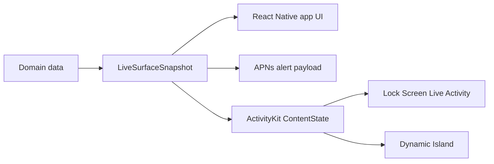

# Architecture

Mobile Surfaces is contract-first. Product data should map into one portable `LiveSurfaceSnapshot`; every surface then derives its own view or payload from that snapshot. The starter is opinionated about the native implementation, but the snapshot contract is intentionally stable.



## Starter Identity

The starter identity is intentionally generic:

- App name: `Mobile Surfaces`
- URL scheme: `mobilesurfaces`
- Example bundle id: `com.example.mobilesurfaces`
- Widget target: `MobileSurfacesWidget`

## V0 Implementation Choice

Use the existing local Expo ActivityKit module for v0, with `@bacons/apple-targets` generating and linking the WidgetKit target during Expo prebuild.

Why:

- The local module is already small and purpose-built: start, update, list, and end ActivityKit activities, plus push token and state events.
- `@bacons/apple-targets` keeps SwiftUI widget source in `apps/mobile/targets/widget/`, outside generated `apps/mobile/ios/`, which fits Continuous Native Generation.
- `software-mansion-labs/expo-live-activity` is a credible future option, but switching now would add dependency churn without improving the starter's contract boundary.
- `expo-widgets` is promising for React-authored widgets and Live Activities, but it is still alpha and has active rendering/runtime rough edges. Treat it as an experiment, not the v0 default.

The code should keep an adapter boundary around Live Activity operations so a future branch can swap the local module for `expo-live-activity` or `expo-widgets` without changing fixtures, docs, or product mapping code.

The harness imports the adapter from `apps/mobile/src/liveActivity/index.ts` as `liveActivityAdapter`. That re-export is the stable swap point: a future adapter only needs to satisfy the same surface (see [Adapter Contract](#adapter-contract)) and replace what is exported from this file. No call site under `apps/mobile/src/` should import from `@mobile-surfaces/live-activity` directly.

## Adapter Contract

Any Live Activity adapter exported from `apps/mobile/src/liveActivity/index.ts` must implement this surface. Future swaps (`expo-live-activity`, `expo-widgets`, a different local module) only need to satisfy it; nothing else under `apps/mobile/src/` should change.

```ts
import type {
  LiveSurfaceActivityContentState,
  LiveSurfaceStage,
} from "@mobile-surfaces/surface-contracts";

export type LiveActivityStage = LiveSurfaceStage;
export type LiveActivityContentState = LiveSurfaceActivityContentState;

export interface LiveActivitySnapshot {
  id: string;
  surfaceId: string;
  modeLabel: string;
  state: LiveActivityContentState;
  pushToken: string | null;
}

export type LiveActivityEvents = {
  onPushToken: (payload: { activityId: string; token: string }) => void;
  onActivityStateChange: (payload: {
    activityId: string;
    state: "active" | "ended" | "dismissed" | "stale" | "pending";
  }) => void;
};

export interface LiveActivityAdapter {
  areActivitiesEnabled(): Promise<boolean>;
  start(
    surfaceId: string,
    modeLabel: string,
    state: LiveActivityContentState,
  ): Promise<{ id: string; state: LiveActivityContentState }>;
  update(activityId: string, state: LiveActivityContentState): Promise<void>;
  end(
    activityId: string,
    dismissalPolicy: "immediate" | "default",
  ): Promise<void>;
  listActive(): Promise<LiveActivitySnapshot[]>;
  addListener<E extends keyof LiveActivityEvents>(
    event: E,
    handler: LiveActivityEvents[E],
  ): { remove(): void };
}
```

Four async methods (`areActivitiesEnabled`, `start`, `update`, `end`, `listActive`) plus two events (`onPushToken`, `onActivityStateChange`). Adding to this surface counts as a breaking change; all adapters and the harness must update together.

## Research Findings

- `expo-widgets`: alpha, iOS-only, dev-build only, and subject to breaking changes. It can create widgets and Live Activities with Expo UI, but recent reports include blank widget bundles and intermittent Live Activity spinner overlays. Not stable enough for the default v0 starter path.
- `software-mansion-labs/expo-live-activity`: a focused Expo module for iOS Live Activities with start, update, stop, and optional push support. It is a good adapter candidate once this starter has a clean boundary, but adopting it now is not required.
- `@bacons/apple-targets`: current best fit for a SwiftUI WidgetKit target in an Expo project. It keeps target source outside generated `ios/` and links it during prebuild.
- Native ActivityKit / WidgetKit: Live Activities update through the app or APNs, cannot do their own network fetches, have a 4 KB data limit, and require all Lock Screen and Dynamic Island layouts to be handled by the widget extension.
- npm create conventions: future scaffolding should publish `create-mobile-surfaces` so users can run `npm create mobile-surfaces@latest`.

## Reusable Foundation

- `packages/surface-contracts/` defines `LiveSurfaceSnapshot`, `LiveSurfaceActivityContentState`, `LiveSurfaceAlertPayload`, generated fixture exports, and mapping helpers.
- `packages/design-tokens/` defines colors and shared token names for React Native and Swift asset catalogs. `tokens.json` is the source of truth used by both TypeScript and the widget target config.
- `data/surface-fixtures/` stores deterministic JSON snapshots used by previews, harness flows, validation, and push smoke tests. TypeScript fixtures are generated from this directory.
- `apps/mobile/` contains the Expo dev-client app and the harness screen.
- `packages/live-activity/` contains `@mobile-surfaces/live-activity`, the Expo native module wrapping ActivityKit.
- `apps/mobile/targets/widget/` contains the SwiftUI Lock Screen and Dynamic Island surfaces.
- `scripts/` contains doctor, setup, APNs, simulator push, and surface validation commands.

## Contract Rules

Domain objects should not flow directly into ActivityKit or APNs payloads. Convert them first:

```ts
const snapshot = mapDomainEventToLiveSurfaceSnapshot(event);
const activityState = toLiveActivityContentState(snapshot);
const alertPayload = toAlertPayload(snapshot);
```

This keeps app-specific data models free to change while the app UI, alert pushes, ActivityKit content state, Lock Screen, and Dynamic Island agree on one portable surface shape.

## Native Constraints

ActivityKit and WidgetKit impose important limits:

- A Live Activity is active for up to 8 hours, then may remain on the Lock Screen for up to 4 more hours.
- Static and dynamic ActivityKit data must stay within Apple's 4 KB payload limit.
- Live Activities cannot fetch network data directly; update through the app or ActivityKit push notifications.
- Dynamic Island is only available on supported iPhone Pro models; the Lock Screen is the primary surface.
- APNs Live Activity updates have system budgets. Prefer low priority updates unless the user needs immediate attention.

## Validation

Run:

```bash
pnpm surface:check
```

The flow:

1. **Zod is the single source of truth.** `packages/surface-contracts/src/schema.ts` defines `liveSurfaceSnapshot` (and the activity / alert payload shapes) as Zod v4 objects. The TypeScript types are inferred from the schema (`z.infer<typeof liveSurfaceSnapshot>`); there is no second hand-written interface to drift.
2. **JSON Schema is generated.** `scripts/build-schema.mjs` calls `z.toJSONSchema` and writes the result to `packages/surface-contracts/schema.json`. `surface:check` runs the generator with `--check` so a stale committed file fails CI.
3. **Fixtures are validated by the same Zod schema.** `scripts/validate-surface-fixtures.mjs` parses every JSON under `data/surface-fixtures/` through `liveSurfaceSnapshot.safeParse`. Fixtures carry a `$schema` pointer for IDE tooling; the validator strips it before parsing because the wire payload itself never carries `$schema`.
4. **Generated TypeScript fixtures are checked for drift** against the JSON via `scripts/generate-surface-fixtures.mjs --check`.
5. **Duplicated ActivityKit attribute files** must stay byte-identical:
   - `packages/live-activity/ios/MobileSurfacesActivityAttributes.swift`
   - `apps/mobile/targets/widget/MobileSurfacesActivityAttributes.swift`

The Swift duplication is intentional: the app module and widget extension compile in separate Swift modules, and ActivityKit relies on matching Codable shapes.

### Schema Evolution

`LiveSurfaceSnapshot` carries a `schemaVersion: "0"` literal. The rule:

- **Bump `schemaVersion` only on a breaking change.** Renaming a field, removing a field, changing a type, tightening a constraint (e.g. an enum drops a value, a string gains a regex it did not have before), or anything that would make a previously valid payload fail to parse.
- **Additive optional fields are non-breaking.** Adding a new `actionLabel`-style optional field does not require a bump. Existing payloads still parse; new clients can read the new field when present.
- **The `unpkg.com/@mobile-surfaces/surface-contracts@0/schema.json` URL pins to major `0`.** Backends point IDE tooling and external validators at it; a future v1 contract would publish at the corresponding major URL.

### Linked Release Group

`.changeset/config.json` links `@mobile-surfaces/surface-contracts`, `@mobile-surfaces/design-tokens`, `@mobile-surfaces/live-activity`, and `create-mobile-surfaces` so they always release at the same version. The CLI ships a baked `template/manifest.json` snapshot of the contract packages; if `surface-contracts` could bump on its own, the published CLI would silently reference stale dependency versions until the next CLI release. Linking forces a CLI republish on every contract change, which is the only way the bundled manifest stays in sync with what users actually install.
