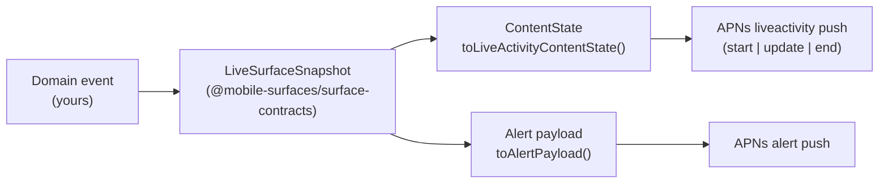

# Backend Integration

How a backend service turns a domain event into an APNs push that this starter can render. Mobile Surfaces ships only the local pieces — fixtures, the contract package, the harness, and APNs smoke scripts. A real production push service is intentionally [out of scope](../README.md#non-goals); the goal of this doc is to make the integration shape obvious so you can build the production half against a stable contract.

## Mental Model

The contract is one type with two derived shapes.



`LiveSurfaceSnapshot` is the only shape your domain code should emit. Everything else is a pure transform. See [`packages/surface-contracts/src/index.ts`](../packages/surface-contracts/src/index.ts) for the full type and the `toLiveActivityContentState` / `toAlertPayload` helpers.

## Snapshot Fields

```ts
interface LiveSurfaceSnapshot {
  id: string;                 // unique per snapshot revision (event-scoped)
  surfaceId: string;          // stable across snapshots for the same surface
  state: "queued" | "active" | "paused" | "attention" | "bad_timing" | "completed";
  modeLabel: string;          // human label, e.g. "queued", "active"
  contextLabel: string;       // optional sub-label, e.g. "starter"
  statusLine: string;         // single line shown in compact regions
  primaryText: string;        // headline / alert title
  secondaryText: string;      // subhead / alert body
  actionLabel?: string;       // CTA label, e.g. "Open surface"
  estimatedSeconds: number;   // remaining work, 0 when unknown
  morePartsCount: number;     // count of extra rows the surface might display
  progress: number;           // 0..1
  stage: "prompted" | "inProgress" | "completing";
  deepLink: string;           // <scheme>://surface/<surfaceId>
}
```

`state` is the canonical state machine: drive the lifecycle from the backend; `stage` is a UI-facing axis (whether the surface is being prompted, actively running, or wrapping up). `progress` is independent of either.

Look at `data/surface-fixtures/*.json` for committed examples of every state.

## End-to-End Walkthrough

The motivating use case: a backend job moves through `queued → active → completed`, and you want a Live Activity on the user's Lock Screen plus a fallback alert push for anyone who has the activity disabled.

### 1. Map the domain event

Stay in your own service for this step. The output is a `LiveSurfaceSnapshot`. A minimal mapper:

```ts
import type { LiveSurfaceSnapshot } from "@mobile-surfaces/surface-contracts";

function snapshotFromJob(job: Job): LiveSurfaceSnapshot {
  const state = job.status === "queued"
    ? "queued"
    : job.status === "running"
    ? "active"
    : job.status === "done"
    ? "completed"
    : "attention";

  return {
    id: `${job.id}@${job.revision}`,
    surfaceId: `job-${job.id}`,
    state,
    modeLabel: state,
    contextLabel: job.queueName,
    statusLine: `${job.queueName} · ${state}`,
    primaryText: job.title,
    secondaryText: job.subtitle ?? "",
    actionLabel: "Open job",
    estimatedSeconds: job.etaSeconds ?? 0,
    morePartsCount: job.extraItems ?? 0,
    progress: clamp01(job.progress ?? 0),
    stage: state === "completed" ? "completing" : state === "queued" ? "prompted" : "inProgress",
    deepLink: `myapp://surface/job-${job.id}`,
  };
}
```

Keep this function pure. Validate the output with `LiveSurfaceSnapshot`'s TypeScript shape; the v0 starter does not ship a runtime validator, but the schema at `packages/surface-contracts/schema.json` is the one source of truth and can be wired into Ajv or Zod as a thin guard if you need it.

### 2. Derive the wire payloads

Use the helpers from `@mobile-surfaces/surface-contracts`.

```ts
import {
  toLiveActivityContentState,
  toAlertPayload,
} from "@mobile-surfaces/surface-contracts";

const snapshot = snapshotFromJob(job);
const contentState = toLiveActivityContentState(snapshot);
//   { headline, subhead, progress, stage }

const alertPayload = toAlertPayload(snapshot);
//   { aps: { alert, sound }, liveSurface: { kind, snapshotId, surfaceId, state, deepLink } }
```

`toLiveActivityContentState` is the projection that matches the Swift `MobileSurfacesActivityAttributes.ContentState` declared in the widget target. If you add a field to the Swift struct, add it here in the same change set; the surface check in CI does not catch this drift on the JS side.

### 3. Send the APNs request

The starter's smoke script is a working reference for the request shape. Production services will use a connection-pooled HTTP/2 client and persisted JWTs, but every header and field below is the same.

Live Activity update:

```
POST https://api.push.apple.com/3/device/<activity-token>
authorization: bearer <ES256 JWT signed with the .p8 auth key>
apns-topic: <bundle-id>.push-type.liveactivity
apns-push-type: liveactivity
apns-priority: 5                # 10 only for user-visible urgency
apns-expiration: <unix-seconds>
content-type: application/json

{
  "aps": {
    "timestamp": <unix-seconds>,
    "event": "update",
    "content-state": { "headline": ..., "subhead": ..., "progress": ..., "stage": ... },
    "stale-date": <optional-unix-seconds>
  }
}
```

Live Activity remote start (iOS 17.2+) requires the static attributes too:

```json
{
  "aps": {
    "timestamp": ...,
    "event": "start",
    "content-state": { ... },
    "attributes-type": "MobileSurfacesActivityAttributes",
    "attributes": { "surfaceId": "...", "modeLabel": "..." },
    "stale-date": ...
  }
}
```

Live Activity end:

```json
{ "aps": { "timestamp": ..., "event": "end", "content-state": { ... }, "dismissal-date": <unix-seconds> } }
```

Alert push (the `toAlertPayload` shape):

```
apns-topic: <bundle-id>           # no push-type suffix
apns-push-type: alert
apns-priority: 10
```

```json
{
  "aps": { "alert": { "title": "...", "body": "..." }, "sound": "default" },
  "liveSurface": { "kind": "surface_snapshot", "snapshotId": "...", "surfaceId": "...", "state": "...", "deepLink": "..." }
}
```

`liveSurface` is your sidecar. The starter does not consume it on the client; it exists so backend events and analytics share the same identifiers as the activity.

### 4. Manage tokens

Three token kinds, three lifetimes. The backend is responsible for storing and rotating them.

- **Device APNs token**: per device, per app install. Used for plain `alert` pushes. Rotates rarely.
- **Push-to-start token**: per user / per `Activity<Attributes>` type, returned from `Activity<…>.pushToStartTokenUpdates` (iOS 17.2+). Used to send `event: "start"`.
- **Per-activity push token**: returned from `Activity.pushTokenUpdates` once iOS issues it after `Activity.request`. Used for `event: "update"` and `event: "end"`. Discard the token when the activity ends.

The harness in this repo surfaces all three for inspection: the bottom row shows the device APNs token; "All active activities" shows the per-activity push token as it streams in.

## Smoke-Test The Backend Path Locally

The starter's APNs script accepts the same flags a backend would set. Once you have an activity token (start one in the harness; the value streams into "All active activities"), exercise updates:

```bash
pnpm mobile:push:device:liveactivity -- \
  --activity-token=<paste> \
  --event=update \
  --state-file=./scripts/sample-state.json \
  --env=development
```

Or send the full `LiveSurfaceSnapshot`-derived state from a fixture by writing a snapshot file your service emits and pointing `--snapshot-file` at it. See [`scripts/README.md`](../scripts/README.md) for the full set of flags, including `--event=start`, `--stale-date`, `--dismissal-date`, and `--priority`.

When something fails, [`docs/troubleshooting.md`](./troubleshooting.md) maps the most common APNs response codes back to causes.

## What Stays Stable

- `LiveSurfaceSnapshot` and its TypeScript schema.
- The two helpers (`toLiveActivityContentState`, `toAlertPayload`) and their projections.
- The APNs topic / push-type / priority defaults.

What can change without notice:

- The Swift `MobileSurfacesActivityAttributes.ContentState` shape — it must agree with `toLiveActivityContentState`'s output, but adding a field is a coordinated change in this repo.
- The smoke script's CLI flags — match the documented set in `scripts/README.md`, do not parse the script itself.
- The local Live Activity adapter under `apps/mobile/modules/live-activity/`. Production backends should not depend on its internals; they depend only on the snapshot contract and APNs.
